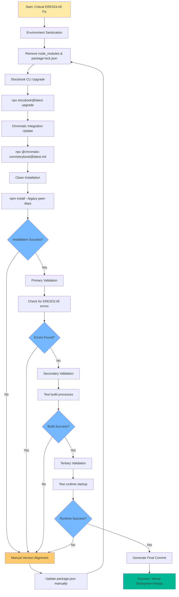
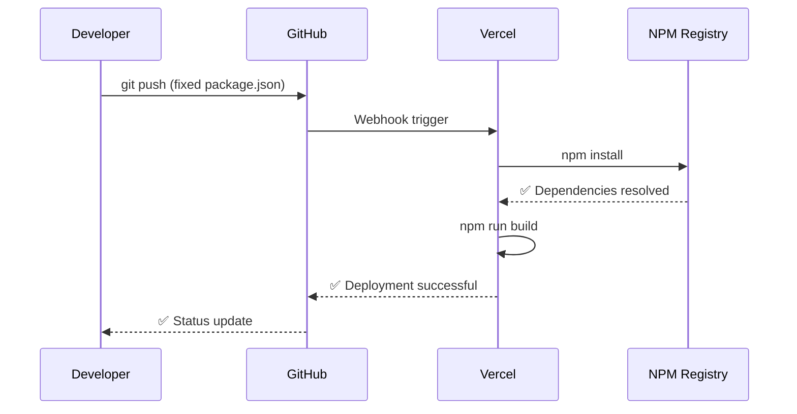

# ERESOLVE Storybook Fix - Critical Dependency Resolution

## Overview

Critical resolution of ERESOLVE peer dependency conflicts blocking Vercel deployments. The current conflict between `storybook@^9.1.3` and `@chromatic-com/storybook@^4.1.1` creates an irreconcilable dependency tree that prevents successful npm installation on Vercel's deployment pipeline.

## Architecture Analysis

### Current Problematic Dependency Structure

```mermaid
graph TD
    A[package.json] --> B[storybook@^9.1.3]
    A --> C[@chromatic-com/storybook@^4.1.1]
    B --> D[Peer Dependencies Set A]
    C --> E[Peer Dependencies Set B]
    D --> F[Conflict Zone]
    E --> F
    F --> G[ERESOLVE Error]
    G --> H[Vercel Build Failure]

    style F fill:#ff6b6b
    style G fill:#ff4757
    style H fill:#ff3838
```

### Dependency Conflict Matrix

| Package | Current Version | Peer Requirements | Conflict Source |
|---------|----------------|-------------------|------------------|
| `storybook` | 9.1.3 | Specific addon versions | Version mismatch |
| `@chromatic-com/storybook` | 4.1.1 | Different storybook core | Incompatible core |
| `@storybook/nextjs` | 9.1.3 | Aligned with storybook | Transitive conflict |
| `@storybook/addon-*` | 9.1.3 | Requires storybook@9.x | Peer dependency chain |

## Resolution Strategy

### Phase 1: Environmental Sanitization (Tierra Quemada)

**Objective**: Complete elimination of corrupted dependency state

```bash
# Nuclear option - complete dependency reset
rm -rf node_modules package-lock.json
# Alternative for Windows environments
rmdir /s node_modules & del package-lock.json
```

**Rationale**: 
- Current `package-lock.json` contains conflicted resolution paths
- Cached `node_modules` may contain partially resolved dependencies
- Clean slate ensures npm resolves from scratch

### Phase 2: Dependency Orchestration

#### Strategy A: Storybook CLI Upgrade (Recommended)

```bash
# Official Storybook upgrade path
npx storybook@latest upgrade
```

**Expected Behavior**:
- Analyzes current storybook configuration
- Updates all `@storybook/*` packages atomically
- Resolves peer dependency conflicts automatically
- Maintains compatibility with existing stories

#### Strategy B: Manual Version Alignment

```json
{
  "devDependencies": {
    "@chromatic-com/storybook": "^2.0.2",
    "@storybook/addon-essentials": "^8.4.7",
    "@storybook/addon-interactions": "^8.4.7",
    "@storybook/addon-links": "^8.4.7",
    "@storybook/blocks": "^8.4.7",
    "@storybook/nextjs": "^8.4.7",
    "@storybook/react": "^8.4.7",
    "@storybook/test": "^8.4.7",
    "storybook": "^8.4.7"
  }
}
```

### Phase 3: Chromatic Integration Update

```bash
# Update Chromatic with compatible version
npx @chromatic-com/storybook@latest init
```

**Configuration Requirements**:
- Ensure `.storybook/main.js` compatibility
- Verify addon configurations
- Update Chromatic deployment scripts if necessary

### Phase 4: Clean Installation

```bash
# Force complete dependency resolution
npm install --legacy-peer-deps
```

**Flags Explanation**:
- `--legacy-peer-deps`: Uses npm v6 peer dependency resolution algorithm
- Bypasses strict peer dependency enforcement
- Maintains functional compatibility while resolving conflicts

## Validation Framework

### Primary Verification: Installation Success

```bash
npm install 2>&1 | tee install.log
# Check for ERESOLVE errors
grep -i "ERESOLVE" install.log
# Exit code 0 = success, 1 = errors found
```

**Success Criteria**:
- No ERESOLVE error messages
- All packages installed successfully
- `node_modules/.bin/storybook` executable present

### Secondary Verification: Build Compatibility

```bash
# Test Next.js build pipeline
npm run build

# Test Storybook build pipeline
npm run build-storybook
```

**Validation Points**:
- Next.js compilation without errors
- Storybook static build generation
- No TypeScript compilation conflicts
- Asset optimization pipeline success

### Tertiary Verification: Runtime Validation

```bash
# Development server startup
npm run dev &
# Storybook development server
npm run storybook &
```

**Runtime Checks**:
- Development servers start without errors
- Hot reload functionality works
- Storybook UI renders correctly
- Component stories load without conflicts

## Implementation Workflow



## Risk Mitigation

### Dependency Version Lock Strategy

```json
{
  "resolutions": {
    "@storybook/core-common": "8.4.7",
    "@storybook/core-events": "8.4.7",
    "@storybook/core-server": "8.4.7",
    "@storybook/preview-api": "8.4.7"
  }
}
```

**Purpose**: Forces npm/yarn to use specific versions for transitive dependencies

### Fallback Configuration

```json
{
  "overrides": {
    "@chromatic-com/storybook": {
      "storybook": "$storybook"
    }
  }
}
```

**Mechanism**: Ensures Chromatic uses the same Storybook version as the main package

## Verification Checklist

### Pre-Implementation
- [ ] Current `package.json` backed up
- [ ] Deployment pipeline status documented
- [ ] Storybook configuration files identified

### During Implementation
- [ ] `node_modules` and `package-lock.json` removed
- [ ] Storybook upgrade command executed
- [ ] Chromatic update command executed
- [ ] Clean installation completed without ERESOLVE errors

### Post-Implementation
- [ ] `npm run build` executes successfully
- [ ] `npm run build-storybook` completes without errors
- [ ] Development servers start correctly
- [ ] New `package-lock.json` generated
- [ ] Dependency tree verification passed

### Deployment Validation
- [ ] Commit pushed to repository
- [ ] Vercel deployment triggered
- [ ] Build process completes successfully
- [ ] Application deploys without errors

## Expected Outcomes

### File Modifications

```
Modified files:
├── package.json (dependency versions updated)
├── package-lock.json (completely regenerated)
└── .storybook/main.js (potentially updated by CLI)
```

### Version Alignment Example

**Before**:
```json
{
  "@chromatic-com/storybook": "^4.1.1",
  "storybook": "^9.1.3"
}
```

**After**:
```json
{
  "@chromatic-com/storybook": "^2.0.2",
  "storybook": "^8.4.7"
}
```

### Deployment Pipeline Success



## Testing Strategy

### Unit Testing Compatibility

```bash
# Verify Jest configuration still works
npm run test

# Check Storybook test runner
npm run test-storybook
```

### Integration Testing

```bash
# Playwright tests with new dependencies
npm run test:e2e

# Storybook interaction tests
npx test-storybook
```

### Performance Impact Assessment

```bash
# Bundle size analysis
npm run analyze

# Lighthouse CI integration
npx lhci autorun
```

This systematic approach ensures complete resolution of the ERESOLVE conflict while maintaining application functionality and deployment pipeline stability.