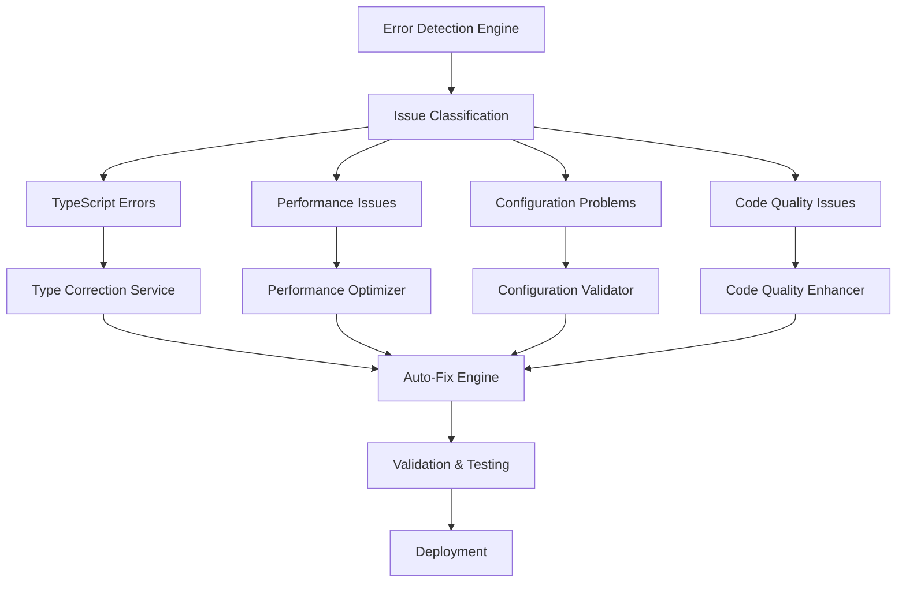
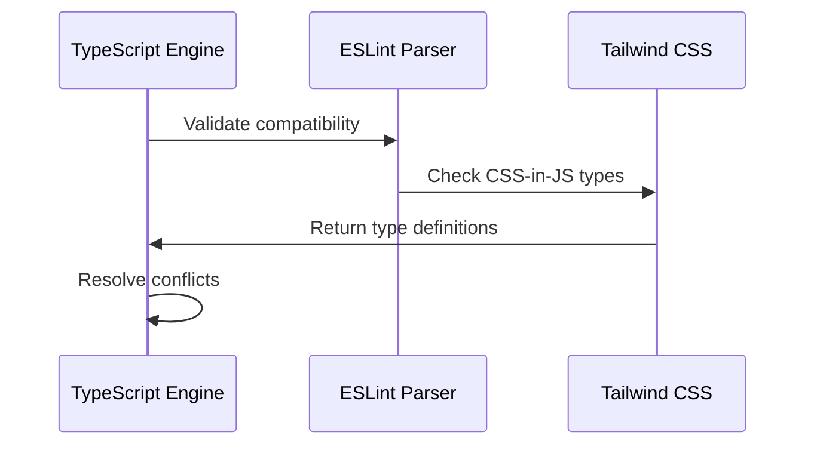
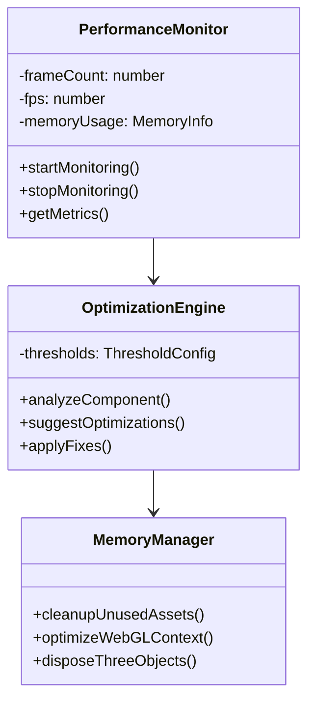
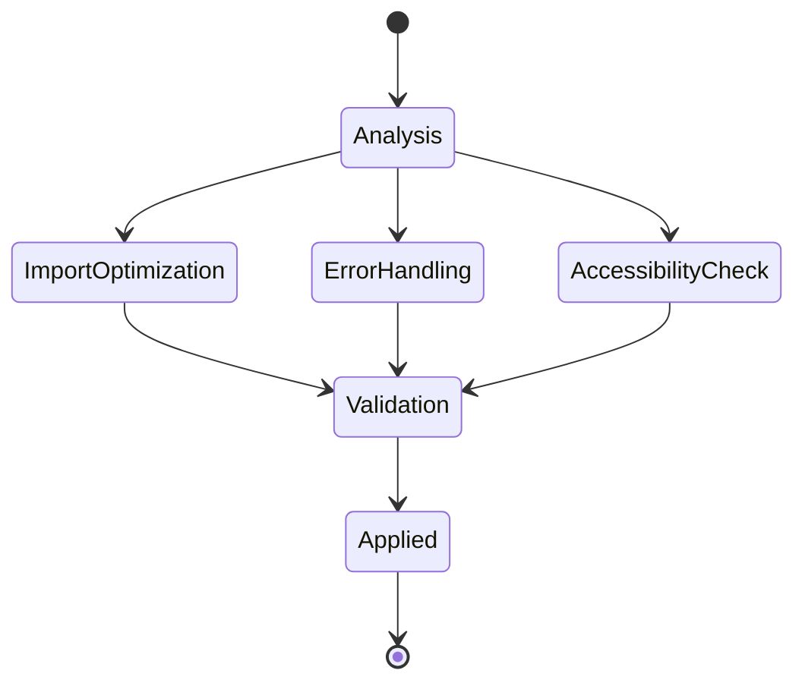
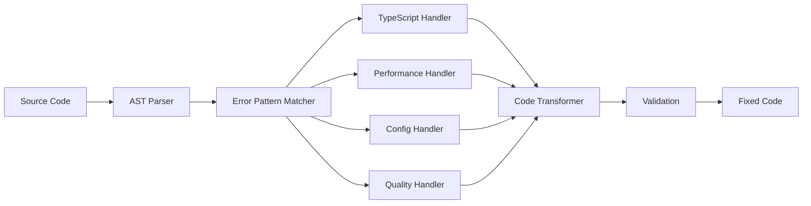
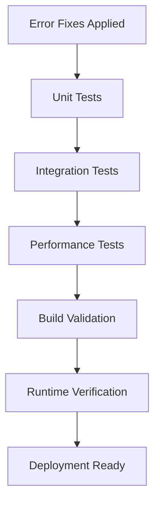

# Error Correction Service Design

## Overview

The SYNARCH Landing Page requires a comprehensive error correction service to identify, categorize, and fix various technical issues found throughout the codebase. This design document outlines a systematic approach to error detection, correction strategies, and preventive measures to maintain code quality and performance.

## Architecture

The error correction service follows a multi-layered architecture that addresses different types of issues systematically:

## Error Categories and Solutions

### TypeScript Configuration Issues

**Identified Problems:**
- Tailwind CSS v4.0.0 compatibility issues with older TypeScript configurations
- Missing type declarations for Three.js GPU extensions
- Potential version conflicts between TypeScript ESLint and core TypeScript

**Solutions:**

#### TypeScript Version Alignment

**Implementation Strategy:**
1. Update TypeScript target to ES2020 for better modern JavaScript support
2. Add missing type declarations for WebGPU API
3. Configure path mapping for better module resolution
4. Implement strict null checks for enhanced type safety

### Performance Optimization Issues

**Identified Problems:**
- Console logging in production code (PerformanceOptimizer.tsx)
- Potential memory leaks in Three.js particle systems
- Inefficient re-renders in animation components
- Missing React.memo optimizations

**Solutions:**

#### Performance Monitoring System

**Implementation Strategy:**
1. Remove console.log statements from production builds
2. Implement proper cleanup for WebGL resources
3. Add React.memo for expensive components
4. Optimize particle system physics calculations

### Configuration Problems

**Identified Problems:**
- Tailwind CSS v4.0 configuration may need updates for new syntax
- PostCSS configuration compatibility issues
- ESLint configuration conflicts between different plugins

**Solutions:**

#### Configuration Validation Pipeline

**Implementation Strategy:**
1. Validate Tailwind CSS v4 configuration syntax
2. Ensure PostCSS plugin compatibility
3. Resolve ESLint configuration conflicts
4. Update Next.js configuration for optimal performance

### Code Quality Issues

**Identified Problems:**
- Potential unused imports in component files
- Missing error boundaries for Three.js components
- Inconsistent error handling patterns
- Missing accessibility attributes in interactive components

**Solutions:**

#### Code Quality Enhancement System

## Error Correction Implementation

### Automated Fix Engine

The automated fix engine processes different error types through specialized handlers:

### Priority Matrix

| Error Type | Severity | Impact | Auto-Fix | Manual Review |
|------------|----------|---------|----------|---------------|
| TypeScript Compilation | High | High | Yes | No |
| Performance Console Logs | Medium | Low | Yes | No |
| Memory Leaks | High | High | Partial | Yes |
| Configuration Issues | Medium | Medium | Yes | No |
| Missing Types | Medium | Medium | Yes | No |
| Unused Imports | Low | Low | Yes | No |
| Accessibility | Medium | High | Partial | Yes |

### Specific Fixes Required

#### 1. Performance Optimizer Cleanup
- Remove production console.log statements
- Add conditional logging for development only
- Implement proper error reporting system

#### 2. TypeScript Configuration Enhancement
- Update target to ES2020
- Add WebGPU type declarations
- Configure strict null checks
- Optimize module resolution

#### 3. Three.js Resource Management
- Implement proper disposal patterns
- Add memory cleanup for particle systems
- Optimize WebGL context usage
- Add error boundaries for 3D components

#### 4. Dependency Resolution
- Resolve Tailwind CSS v4 compatibility
- Update ESLint configuration
- Ensure Next.js 15+ compatibility
- Optimize bundle size

### Testing Strategy

**Test Categories:**
1. **Compilation Tests** - Ensure TypeScript builds without errors
2. **Performance Tests** - Validate FPS and memory usage
3. **Functionality Tests** - Verify all components work correctly
4. **Accessibility Tests** - Ensure WCAG compliance
5. **Cross-Browser Tests** - Validate WebGL compatibility

## Monitoring and Alerts

### Real-time Error Detection
- TypeScript compilation error monitoring
- Runtime performance metrics
- Memory usage tracking
- User interaction error reporting

### Alert System
- Build failure notifications
- Performance degradation alerts
- Memory leak detection
- Console error monitoring

## Implementation Timeline

1. **Phase 1: Critical Fixes** (Immediate)
   - Remove console.log statements
   - Fix TypeScript configuration
   - Resolve build errors

2. **Phase 2: Performance Optimization** (Week 1)
   - Implement React.memo optimizations
   - Add Three.js resource cleanup
   - Optimize particle systems

3. **Phase 3: Quality Enhancements** (Week 2)
   - Add error boundaries
   - Improve accessibility
   - Enhance code documentation

4. **Phase 4: Monitoring Setup** (Week 3)
   - Implement error tracking
   - Set up performance monitoring
   - Configure automated alerts

## Maintenance Strategy

### Automated Maintenance
- Daily dependency vulnerability scans
- Weekly performance audits
- Monthly code quality reviews
- Automated fix suggestions

### Manual Reviews
- Quarterly architecture reviews
- Bi-annual security audits
- Performance optimization reviews
- User experience evaluations

## Risk Mitigation

| Risk | Probability | Impact | Mitigation |
|------|-------------|---------|------------|
| Breaking Changes | Medium | High | Staged rollouts, feature flags |
| Performance Regression | Low | Medium | Automated performance tests |
| Type Errors | Medium | Medium | Strict TypeScript configuration |
| Memory Leaks | Low | High | Comprehensive cleanup patterns |
| Configuration Conflicts | Medium | Low | Version pinning, lock files |