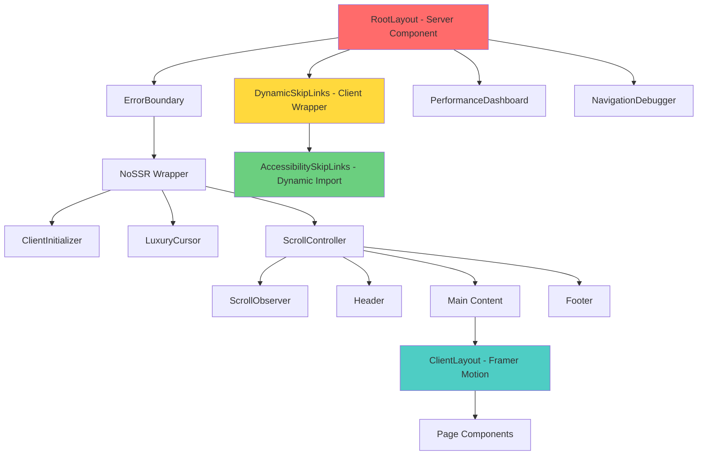
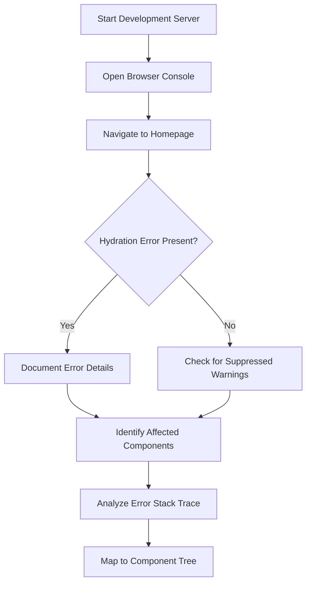

# Hydration Error Fix - Comprehensive Audit and Repair Design

## Overview

This design document outlines a comprehensive strategy to diagnose, audit, and fix the critical **Hydration Failed** error in the Synarch Next.js application. The error creates a cascade of client-side rendering issues, including navigation invisibility and compilation blockages that prevent proper application functionality.

## Repository Type Analysis

**Classification**: Frontend Application (Next.js/React)

The Synarch landing page is a sophisticated Next.js 15 application featuring:
- Server-side rendering with client hydration
- Advanced 3D graphics and animations (GSAP, Framer Motion)
- Luxury UI components with accessibility features
- Performance monitoring and error boundaries
- Complex state management across client/server boundaries

## Technology Stack & Dependencies

### Core Framework
- **Next.js 15.4.7** with App Router
- **React 18.3.1** with modern hooks and concurrent features
- **TypeScript 5.9.2** for type safety

### UI & Animation Libraries
- **Framer Motion 12.23.12** for complex animations
- **GSAP 3.13.0** for high-performance transitions
- **Tailwind CSS 3.4.0** for styling
- **Headless UI 2.2.7** for accessible components

### Visualization & Interactivity
- **D3.js 7.9.0** for data visualization
- **Lucide React** for iconography
- **CMDK** for command palette functionality

## Current Architecture Analysis

### Component Hierarchy



### Identified Hydration Risk Points

1. **DynamicSkipLinks Component** - Uses dynamic imports with `ssr: false`
2. **ClientLayout** - Framer Motion animations with pathname-based keys
3. **AccessibilitySkipLinks** - Client-only rendering with mount detection
4. **LuxuryCursor** - Browser-specific cursor interactions
5. **ScrollController** - DOM manipulation and scroll events

## Root Cause Analysis

### Primary Issue: Server-Client Rendering Mismatch

The hydration error stems from components that render differently on the server versus the client, particularly:

1. **Dynamic Import Configuration**: The `DynamicSkipLinks` component uses `{ ssr: false }` which creates a server-client markup mismatch
2. **Mount State Management**: Multiple components use `useState` and `useEffect` to control client-only rendering
3. **Browser API Dependencies**: Components accessing `window`, `navigator`, or DOM APIs during SSR

### Secondary Issues

1. **Animation State Inconsistency**: Framer Motion components may have different initial states
2. **Accessibility Component Race Conditions**: Skip links and accessibility managers initializing at different times
3. **Performance Monitor Interference**: Development tools causing additional hydration conflicts

## Solution Architecture

### Phase 1: Diagnostic Protocol

#### 1.1 Error Confirmation Strategy


#### 1.2 Component Analysis Protocol
- **Console Monitoring**: Track React hydration warnings and errors
- **Component Isolation**: Test individual components for hydration safety
- **Browser DevTools**: Use React DevTools to identify mismatched components
- **Network Analysis**: Verify static resource loading

### Phase 2: Client Boundary Implementation

#### 2.1 Enhanced Client Wrapper Pattern
```typescript
// components/ClientBoundary.tsx
'use client'

import { useEffect, useState } from 'react'

interface ClientBoundaryProps {
  children: React.ReactNode
  fallback?: React.ReactNode
  suppressHydrationWarning?: boolean
}

export default function ClientBoundary({ 
  children, 
  fallback = null,
  suppressHydrationWarning = false 
}: ClientBoundaryProps) {
  const [hasMounted, setHasMounted] = useState(false)
  
  useEffect(() => {
    setHasMounted(true)
  }, [])
  
  if (!hasMounted) {
    return fallback
  }
  
  return (
    <div suppressHydrationWarning={suppressHydrationWarning}>
      {children}
    </div>
  )
}
```

#### 2.2 Safe Dynamic Import Pattern
```typescript
// components/SafeDynamicSkipLinks.tsx
'use client'

import { lazy, Suspense } from 'react'
import ClientBoundary from './ClientBoundary'

const AccessibilitySkipLinks = lazy(() => 
  import('./AccessibilitySkipLinks').then(module => ({
    default: module.default
  }))
)

export default function SafeDynamicSkipLinks() {
  return (
    <ClientBoundary suppressHydrationWarning>
      <Suspense fallback={null}>
        <AccessibilitySkipLinks />
      </Suspense>
    </ClientBoundary>
  )
}
```

#### 2.3 Layout Refactoring Strategy
```typescript
// app/layout.tsx modifications
export default function RootLayout({ children }: { children: React.ReactNode }) {
  return (
    <html lang="en" suppressHydrationWarning>
      <body>
        {/* Safe client-only rendering */}
        <SafeDynamicSkipLinks />
        
        <ErrorBoundary feature="app-root">
          <ClientBoundary>
            <ClientInitializer />
            <LuxuryCursor />
            <ScrollController>
              {/* Server-safe content */}
              <Header />
              <main>
                <ClientLayout>{children}</ClientLayout>
              </main>
              <Footer />
            </ScrollController>
          </ClientBoundary>
        </ErrorBoundary>
      </body>
    </html>
  )
}
```

### Phase 3: Component Hardening

#### 3.1 Animation Safety Protocol
```typescript
// Enhanced ClientLayout with hydration safety
'use client'

import { useEffect, useState } from 'react'
import { AnimatePresence, motion } from 'framer-motion'

export default function ClientLayout({ children }: { children: React.ReactNode }) {
  const [isHydrated, setIsHydrated] = useState(false)
  
  useEffect(() => {
    setIsHydrated(true)
  }, [])
  
  if (!isHydrated) {
    return <div>{children}</div>
  }
  
  return (
    <AnimatePresence mode="wait">
      <motion.div
        initial={{ opacity: 0 }}
        animate={{ opacity: 1 }}
        exit={{ opacity: 0 }}
      >
        {children}
      </motion.div>
    </AnimatePresence>
  )
}
```

#### 3.2 Accessibility Component Hardening
```typescript
// Enhanced AccessibilitySkipLinks
'use client'

export default function AccessibilitySkipLinks() {
  const [mounted, setMounted] = useState(false)
  
  useEffect(() => {
    // Ensure DOM is ready
    const timer = setTimeout(() => setMounted(true), 0)
    return () => clearTimeout(timer)
  }, [])
  
  // Prevent any server-side rendering
  if (typeof window === 'undefined' || !mounted) {
    return null
  }
  
  return (
    <div suppressHydrationWarning>
      {/* Skip link implementation */}
    </div>
  )
}
```

## Implementation Execution Plan

### Phase 1: Diagnosis (Duration: 30 minutes)

#### Step 1.1: Environment Setup
```bash
# Start development server
npm run dev

# Monitor console for hydration errors
# Document specific error messages and components
```

#### Step 1.2: Error Documentation
- Record exact error messages
- Identify affected component paths
- Note browser-specific variations
- Capture React DevTools warnings

### Phase 2: Root Fix Implementation (Duration: 60 minutes)

#### Step 2.1: Create Client Boundary Components
1. Create `components/ClientBoundary.tsx`
2. Create `components/SafeDynamicSkipLinks.tsx`
3. Update import statements in `app/layout.tsx`

#### Step 2.2: Layout Refactoring
1. Replace `DynamicSkipLinks` with `SafeDynamicSkipLinks`
2. Wrap problematic components in `ClientBoundary`
3. Add strategic `suppressHydrationWarning` attributes

#### Step 2.3: Component Hardening
1. Update `ClientLayout.tsx` with hydration safety
2. Enhance `AccessibilitySkipLinks.tsx` mount detection
3. Add safeguards to animation components

### Phase 3: Validation & Testing (Duration: 45 minutes)

#### Step 3.1: Build Verification
```bash
# Verify clean compilation
npm run build

# Check for build-time errors
npm run lint
```

#### Step 3.2: Runtime Testing
1. Test home page hydration
2. Navigate through all routes (`/`, `/thesis`, `/entities`, `/contact`)
3. Verify navigation visibility and functionality
4. Confirm accessibility features work correctly

#### Step 3.3: Performance Validation
- Check console for remaining errors
- Verify Core Web Vitals metrics
- Test accessibility skip links functionality
- Confirm responsive behavior

## Success Criteria

### Phase 1 Success Metrics
- [ ] Hydration error confirmed and documented
- [ ] Affected components identified
- [ ] Error stack trace mapped to component tree

### Phase 2 Success Metrics
- [ ] `npm run build` completes without errors
- [ ] No compilation warnings related to SSR
- [ ] Client boundary pattern implemented correctly

### Phase 3 Success Metrics
- [ ] No hydration errors in browser console
- [ ] Navigation remains visible during client-side routing
- [ ] Accessibility skip links function properly
- [ ] All page transitions work smoothly
- [ ] Performance metrics remain within acceptable ranges

## Risk Mitigation Strategies

### Rollback Protocol
1. **Git Commit Points**: Create commits after each major change
2. **Component Isolation**: Test each modified component independently
3. **Feature Flags**: Use environment variables to toggle new implementations
4. **Gradual Rollout**: Implement changes incrementally

### Performance Impact Monitoring
```typescript
// Performance impact assessment
const performanceMetrics = {
  beforeFix: {
    FCP: 'baseline_fcp_time',
    LCP: 'baseline_lcp_time', 
    CLS: 'baseline_cls_score'
  },
  afterFix: {
    FCP: 'new_fcp_time',
    LCP: 'new_lcp_time',
    CLS: 'new_cls_score'
  }
}
```

### Browser Compatibility Matrix
- **Chrome/Edge**: Primary testing target
- **Firefox**: Secondary validation
- **Safari**: iOS/macOS compatibility check
- **Mobile Browsers**: Touch interaction validation

## Monitoring & Maintenance

### Post-Fix Monitoring
1. **Error Tracking**: Monitor for new hydration issues
2. **Performance Metrics**: Track Core Web Vitals changes
3. **User Experience**: Validate accessibility improvements
4. **Development Workflow**: Ensure build process remains stable

### Long-term Maintenance Strategy
- Regular React/Next.js version updates
- Continuous accessibility auditing
- Performance regression testing
- Component library hygiene maintenance

## Documentation Updates

### Required Documentation Changes
1. Update component README files
2. Document hydration safety patterns
3. Create troubleshooting guide for similar issues
4. Update development setup instructions

### Knowledge Transfer
- Document lessons learned
- Create reusable patterns for future components
- Establish hydration safety guidelines
- Update code review checklist