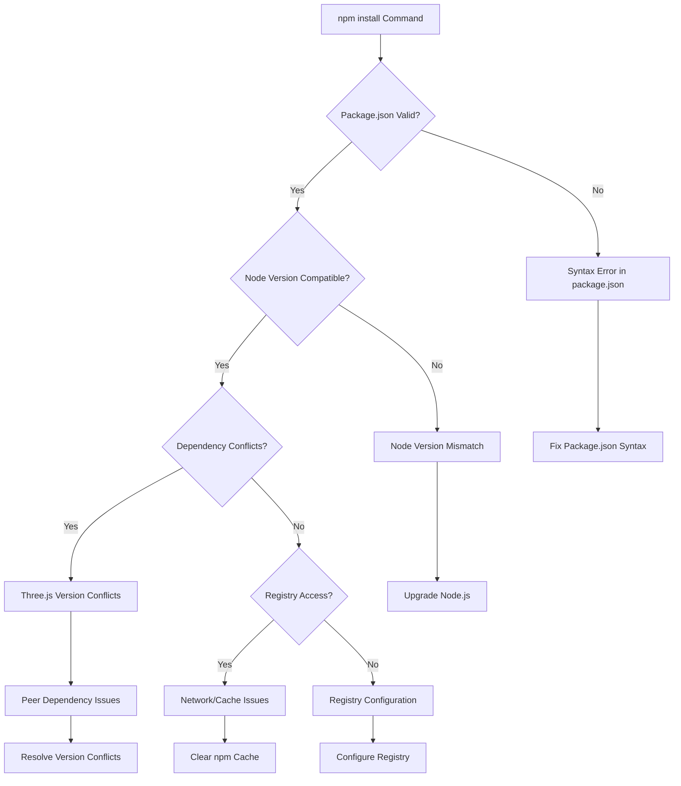
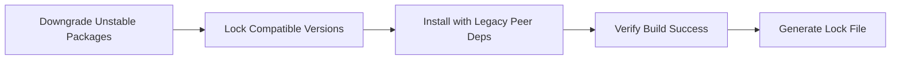
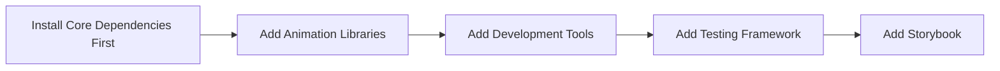

# NPM Install Fix Design Document

## Overview

The project is experiencing npm install failures (exit code 1) in a Next.js 15.1.0 luxury landing page application built with React 18, TypeScript, and Tailwind CSS. The application includes advanced 3D animations using Three.js, React Three Fiber, and various animation libraries. This design document analyzes the root causes and provides a systematic approach to resolve dependency installation issues.

## Architecture Analysis

### Project Type: Frontend Application (Next.js)
- **Framework**: Next.js 15.1.0 with Turbo mode
- **Runtime**: React 18.3.1 + TypeScript 5.7.2
- **Styling**: Tailwind CSS 4.0.0 with PostCSS
- **3D Graphics**: Three.js 0.158.0 + React Three Fiber 8.15.0 + Drei 9.100.0
- **Animation**: Framer Motion 12.23.12 + GSAP 3.14.0
- **Development**: ESLint 9.17.0 + Prettier 3.4.2 + Storybook 8.4.7

### Current State Analysis


## Root Cause Analysis

### Primary Issues Identified

#### 1. Missing package-lock.json
- **Symptom**: No `package-lock.json` file present
- **Impact**: No dependency version locking, potential for version conflicts
- **Risk Level**: High

#### 2. Three.js Ecosystem Conflicts
- **Current Versions**:
  - `three`: ^0.158.0
  - `@react-three/fiber`: ^8.15.0
  - `@react-three/drei`: ^9.100.0
- **Potential Issue**: Version compatibility matrix between Three.js core and React ecosystem
- **Risk Level**: High

#### 3. Next.js 15.1.0 Breaking Changes
- **Symptom**: Using latest Next.js with potential breaking changes
- **Impact**: Dependency compatibility issues with existing packages
- **Risk Level**: Medium

#### 4. Tailwind CSS 4.0.0 Alpha
- **Current Version**: ^4.0.0 (Alpha/Beta release)
- **Impact**: Unstable API, potential compatibility issues
- **Risk Level**: Medium

#### 5. Node.js Version Compatibility
- **Required**: Node.js 18.x or 20.x LTS
- **Impact**: Package compilation failures if using older Node versions
- **Risk Level**: Medium

## Solution Design

### Phase 1: Environment Validation

#### Step 1.1: Node.js Version Check
```bash
# Verify Node.js version
node --version
npm --version

# Required: Node.js >= 18.0.0
# Recommended: Node.js 20.x LTS
```

#### Step 1.2: Clean Installation Environment
```bash
# Remove existing node_modules and lock files
rm -rf node_modules
rm -f package-lock.json
rm -f yarn.lock

# Clear npm cache
npm cache clean --force
```

### Phase 2: Dependency Resolution Strategy

#### Strategy 2.1: Conservative Approach (Recommended)


**Package Version Adjustments**:
- Tailwind CSS: `3.4.0` (stable) instead of `4.0.0`
- Three.js: Maintain `0.158.0` but verify React Three ecosystem compatibility

#### Strategy 2.2: Progressive Approach (Alternative)


### Phase 3: Installation Execution

#### Step 3.1: Core Dependencies Installation
```bash
# Install core Next.js and React dependencies first
npm install next@15.1.0 react@18.3.1 react-dom@18.3.1

# Install TypeScript support
npm install --save-dev typescript@5.7.2 @types/node@22.10.2 @types/react@18.3.17 @types/react-dom@18.3.5
```

#### Step 3.2: Three.js Ecosystem Installation
```bash
# Install Three.js with specific compatible versions
npm install three@0.158.0
npm install @react-three/fiber@8.15.0 @react-three/drei@9.100.0
npm install --save-dev @types/three@0.158.0

# Alternative with legacy peer deps if conflicts occur
npm install three@0.158.0 @react-three/fiber@8.15.0 @react-three/drei@9.100.0 --legacy-peer-deps
```

#### Step 3.3: Styling and Animation Libraries
```bash
# Install Tailwind CSS (stable version)
npm install tailwindcss@3.4.0 postcss@8.5.1 autoprefixer@10.4.20

# Install animation libraries
npm install framer-motion@12.23.12 gsap@3.14.0 react-spring@9.7.4
```

#### Step 3.4: Complete Installation with Legacy Support
```bash
# If peer dependency conflicts persist, use legacy mode
npm install --legacy-peer-deps

# Alternative: Use npm audit fix for automatic resolution
npm audit fix --force
```

### Phase 4: Configuration Validation

#### Step 4.1: TypeScript Configuration Check
```typescript
// Verify tsconfig.json has correct module resolution
{
  "compilerOptions": {
    "moduleResolution": "bundler",
    "module": "esnext",
    "target": "ES2020",
    "jsx": "preserve"
  }
}
```

#### Step 4.2: Tailwind Configuration Validation
```javascript
// Ensure tailwind.config.ts imports are valid
import type { Config } from 'tailwindcss'
import containerQueries from '@tailwindcss/container-queries'
```

#### Step 4.3: Next.js Configuration
```javascript
// Create or verify next.config.js for Three.js support
/** @type {import('next').NextConfig} */
const nextConfig = {
  experimental: {
    optimizePackageImports: ['three', '@react-three/fiber', '@react-three/drei']
  },
  webpack: (config) => {
    config.externals.push({
      'utf-8-validate': 'commonjs utf-8-validate',
      'bufferutil': 'commonjs bufferutil'
    })
    return config
  }
}

module.exports = nextConfig
```

## Testing Strategy

### Verification Steps

#### 1. Installation Verification
```bash
# Verify all dependencies are installed
npm ls

# Check for vulnerabilities
npm audit

# Verify build process
npm run build
```

#### 2. Development Server Test
```bash
# Start development server
npm run dev

# Verify no console errors
# Test 3D components load correctly
# Verify Tailwind styles apply
```

#### 3. Component Testing
```bash
# Run unit tests
npm test

# Run Storybook
npm run storybook
```

## Error Handling Matrix

| Error Type | Symptom | Solution |
|------------|---------|----------|
| Peer Dependency | `ERESOLVE unable to resolve dependency tree` | Use `--legacy-peer-deps` flag |
| Node Version | `Unsupported engine` | Upgrade to Node.js 18+ or 20 LTS |
| Three.js Conflicts | `Module not found: three` | Install compatible versions in sequence |
| Tailwind 4.0 Issues | `Plugin registration failed` | Downgrade to Tailwind CSS 3.4.0 |
| Network Timeout | `Request timeout` | Configure npm registry or use different network |
| Cache Corruption | `Integrity check failed` | Clear npm cache and reinstall |

## Monitoring and Maintenance

### Success Metrics
- `npm install` completes without errors (exit code 0)
- `npm run build` succeeds
- `npm run dev` starts development server
- All TypeScript compilation passes
- No console errors in browser
- 3D components render correctly

### Ongoing Maintenance
```bash
# Regular dependency updates (monthly)
npm outdated
npm update

# Security audits (weekly)
npm audit
npm audit fix

# Lock file maintenance
npm install --package-lock-only
```

## Implementation Timeline

| Phase | Duration | Priority | Dependencies |
|-------|----------|----------|--------------|
| Environment Validation | 30 minutes | Critical | Node.js version check |
| Dependency Resolution | 45 minutes | Critical | Clean environment |
| Installation Execution | 60 minutes | Critical | Resolved dependencies |
| Configuration Validation | 30 minutes | High | Successful installation |
| Testing Strategy | 30 minutes | High | Working development setup |

## Risk Mitigation

### Fallback Strategies
1. **Version Rollback**: If current versions fail, use known working versions
2. **Alternative Package Manager**: Switch to `yarn` or `pnpm` if npm fails
3. **Docker Environment**: Use containerized environment for consistent setup
4. **Manual Dependency Resolution**: Install packages individually to isolate conflicts

### Prevention Measures
1. **Lock File Commitment**: Always commit `package-lock.json`
2. **Version Pinning**: Use exact versions for critical dependencies
3. **Regular Updates**: Scheduled dependency updates with testing
4. **CI/CD Integration**: Automated dependency vulnerability scanning