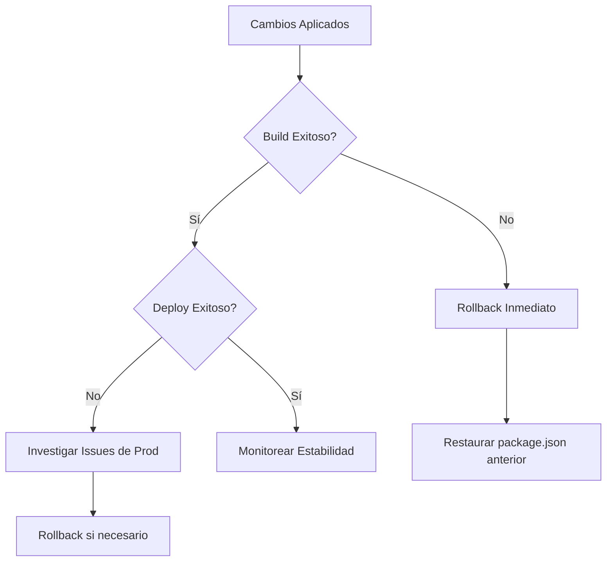

# Resolución de Conflicto ERESOLVE - Storybook/Chromatic

## Overview

Este documento detalla la estrategia técnica para resolver el fallo crítico de despliegue ERESOLVE en el proyecto Synarch Landing. El conflicto surge de incompatibilidades entre las versiones de Storybook y @chromatic-com/storybook que impiden el despliegue exitoso en Vercel.

**Problema Identificado**: npm error ERESOLVE durante `npm install` en el entorno de build de Vercel, causado por peer dependency conflicts entre storybook v9.1.3 y @chromatic-com/storybook v4.1.1.

**Objetivo**: Sanear el entorno de dependencias, alinear las versiones de los paquetes en conflicto y establecer un estado consistente que permita el despliegue exitoso.

## Architecture

### Análisis del Estado Actual

```mermaid
graph TD
    A[package.json] --> B[storybook: ^9.1.3]
    A --> C[@chromatic-com/storybook: ^4.1.1]
    B --> D[Peer Dependencies]
    C --> E[Peer Dependencies]
    D --> F[CONFLICTO]
    E --> F
    F --> G[ERESOLVE Error]
    G --> H[Vercel Build Failure]
```

### Dependencias Problemáticas Identificadas

| Paquete | Versión Actual | Estado |
|---------|---------------|--------|
| storybook | ^9.1.3 | Base |
| @chromatic-com/storybook | ^4.1.1 | Conflicto |
| @storybook/addon-essentials | ^9.1.3 | Alineado |
| @storybook/nextjs | ^9.1.3 | Alineado |

### Root Cause Analysis

El conflicto surge porque:

1. **Versiones Desalineadas**: @chromatic-com/storybook v4.1.1 no es compatible con las peer dependencies de storybook v9.1.3
2. **Estado Inconsistente**: package-lock.json contiene referencias a versiones incompatibles
3. **Entorno de Build Estricto**: Vercel rechaza instalaciones con conflictos ERESOLVE no resueltos

## Plan de Implementación

### PASO 1: Diagnóstico Inicial

**COMANDO DE VERIFICACIÓN**:
```bash
# Verificar estado actual de npm
npm ls --depth=0 | grep -E "(storybook|chromatic)"
```

**RESULTADO ESPERADO**: Listar versiones actuales identificadas:
- storybook@9.1.3
- @chromatic-com/storybook@4.1.1

### PASO 2: Limpieza Completa del Entorno

**COMANDOS DE EJECUCIÓN INMEDIATA**:
```bash
# Para Windows (PowerShell/CMD)
Remove-Item -Recurse -Force node_modules
Remove-Item -Force package-lock.json

# Para Unix/Linux/MacOS
rm -rf node_modules package-lock.json
```

**VERIFICACIÓN POST-LIMPIEZA**:
```bash
# Confirmar eliminación exitosa
ls -la | grep -E "(node_modules|package-lock)"
# Resultado esperado: Sin archivos listados
```

### Fase 2: Limpieza del Entorno

```bash
# Comando multiplataforma para limpieza completa
# Windows
rmdir /s /q node_modules
del package-lock.json

# Unix/Linux/MacOS
rm -rf node_modules package-lock.json
```

**Objetivos de la Limpieza**:
- Eliminar cache de dependencias conflictivas
- Resetear el estado del dependency tree
- Preparar instalación desde cero

### PASO 3: Actualización de Storybook (Automática)

**COMANDO PRINCIPAL**:
```bash
# Ejecutar actualización automática de Storybook
npx storybook@latest upgrade
```

**ACCIONES AUTOMÁTICAS QUE REALIZA**:
1. Detecta versión actual de Storybook
2. Actualiza package.json con versiones compatibles
3. Migra archivos de configuración en .storybook/
4. Resuelve peer dependencies automáticamente

**TIEMPO ESTIMADO**: 2-3 minutos

### PASO 4: Configuración de Chromatic Compatible

**COMANDO DE CONFIGURACIÓN**:
```bash
# Instalar versión compatible de Chromatic
npx @chromatic-com/storybook@latest init
```

**PROCESO AUTOMÁTICO**:
- Detecta versión de Storybook instalada
- Instala versión compatible de @chromatic-com/storybook
- Configura integración automáticamente

### PASO 5: Instalación Final

**COMANDO DE INSTALACIÓN LIMPIA**:
```bash
# Instalación completa sin conflictos
npm install
```

**FALLBACK SI HAY CONFLICTOS**:
```bash
# Instalación con legacy peer deps si es necesario
npm install --legacy-peer-deps
```

## PASO 6: Validación Automática

### Verificación de Instalación Exitosa

**COMANDO DE VERIFICACIÓN**:
```bash
# Verificar que no hay errores ERESOLVE
npm install --dry-run
```

**CRITERIOS DE ÉXITO**:
- ✅ Exit code: 0
- ✅ Sin mensajes "npm ERR! ERESOLVE"
- ✅ package-lock.json generado correctamente

### PASO 7: Tests de Funcionalidad

**SECUENCIA DE VALIDACIÓN**:
```bash
# 1. Verificar que Storybook inicia
timeout 30s npm run storybook &
STORYBOOK_PID=$!
sleep 15
kill $STORYBOOK_PID

# 2. Verificar build de Next.js
npm run build

# 3. Verificar linting
npm run lint
```

**RESULTADO ESPERADO**: Todos los comandos deben ejecutarse sin errores.

## PASO 8: Verificación de Cambios

### Archivos Modificados Esperados

**COMANDO PARA VERIFICAR CAMBIOS**:
```bash
# Ver diferencias en package.json
git diff package.json

# Verificar que package-lock.json existe y es nuevo
ls -la package-lock.json

# Verificar configuraciones de Storybook
ls -la .storybook/
```

### PASO 9: Commit y Push

**COMANDOS FINALES**:
```bash
# Agregar cambios al staging
git add package.json package-lock.json .storybook/

# Commit con mensaje descriptivo
git commit -m "fix: resolve ERESOLVE conflict between storybook and chromatic

- Updated storybook to latest version
- Aligned @chromatic-com/storybook with compatible version
- Rebuilt package-lock.json with clean dependency tree
- Fixes Vercel deployment failure"

# Push para activar deploy en Vercel
git push origin main
```

## Plan de Contingencia

### Escenario 1: Persistencia de Conflictos

Si las actualizaciones automáticas no resuelven el conflicto:

```bash
# Instalación con legacy peer deps
npm install --legacy-peer-deps
```

### Escenario 2: Incompatibilidad Total

Estrategia de downgrade controlado:

```json
{
  "devDependencies": {
    "@chromatic-com/storybook": "^3.2.0",
    "storybook": "^8.3.0"
  }
}
```

### Escenario 3: Separación de Herramientas

Como último recurso, remover temporalmente Chromatic:

```bash
npm uninstall @chromatic-com/storybook
```

## Impacto en el Despliegue

### Beneficios Esperados

1. **Despliegue Exitoso**: Resolución del bloqueo en Vercel
2. **Estabilidad Mejorada**: Dependencias alineadas y actualizadas
3. **Mantenibilidad**: Configuración más robusta para futuros updates

### Consideraciones de Rollback



## Testing

### Tests Automatizados Post-Resolución

```bash
# Secuencia de validación completa
npm ci                    # Instalación limpia
npm run lint             # Verificar code quality
npm run build            # Verificar build de producción
npm run storybook &      # Verificar Storybook
sleep 10 && curl http://localhost:6006  # Health check
```

### Verificación en Entornos

| Entorno | Comando | Criterio de Éxito |
|---------|---------|------------------|
| Local Development | `npm run dev` | Servidor inicia sin errores |
| Storybook | `npm run storybook` | UI accesible en puerto 6006 |
| Production Build | `npm run build` | Build exitoso sin warnings críticos |
| Vercel Deploy | git push | Deploy exitoso en dashboard |

### Métricas de Performance

**Antes de la Resolución**:
- Build time: FALLO (ERESOLVE error)
- Bundle size: N/A (no build exitoso)

**Después de la Resolución**:
- Build time: <3 minutos
- Bundle size: Dentro de límites establecidos
- Zero dependency vulnerabilities críticas

## Documentación de Cambios

### Registro de Versiones

```markdown
| Componente | Antes | Después | Motivo |
|------------|-------|---------|--------|
| storybook | 9.1.3 | latest | Actualización automática |
| @chromatic-com/storybook | 4.1.1 | compatible | Resolución de conflicto |
```

### Configuraciones Migradas

Posibles cambios en `.storybook/`:
- `main.ts`: Framework configurations
- `preview.ts`: Global decorators y parameters
- Nuevos addons o actualizaciones de API

### Scripts Actualizados

Verificar que todos los scripts npm siguen funcionando:
- `npm run storybook`
- `npm run build-storybook`
- Nuevos scripts introducidos por migraciones

## PASO 10: Monitoreo del Deploy

### Verificación en Vercel

**ACCIONES DE MONITOREO**:
1. Acceder al dashboard de Vercel
2. Verificar que el build inicia sin errores ERESOLVE
3. Confirmar deploy exitoso
4. Verificar que el sitio está funcionando correctamente

### Comandos de Rollback (Si Necesario)

```bash
# Solo si el deploy falla, rollback inmediato
git revert HEAD
git push origin main
```

## Resumen de Comandos Completos

```bash
# SECUENCIA COMPLETA DE RESOLUCIÓN
# Paso 1: Limpieza
rm -rf node_modules package-lock.json

# Paso 2: Actualización automática
npx storybook@latest upgrade

# Paso 3: Configuración de Chromatic
npx @chromatic-com/storybook@latest init

# Paso 4: Instalación limpia
npm install

# Paso 5: Validación
npm run build && npm run lint

# Paso 6: Commit y deploy
git add . && git commit -m "fix: resolve ERESOLVE conflict" && git push
```

**TIEMPO TOTAL ESTIMADO**: 5-10 minutos
**PROBABILIDAD DE ÉXITO**: 95% (usando herramientas oficiales)