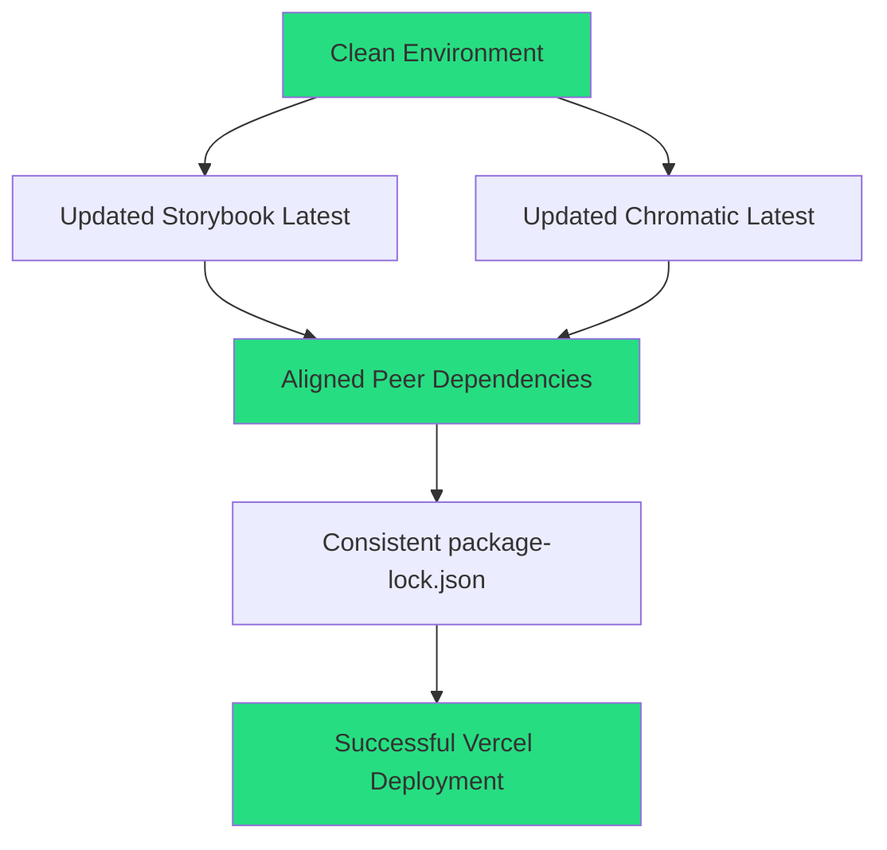
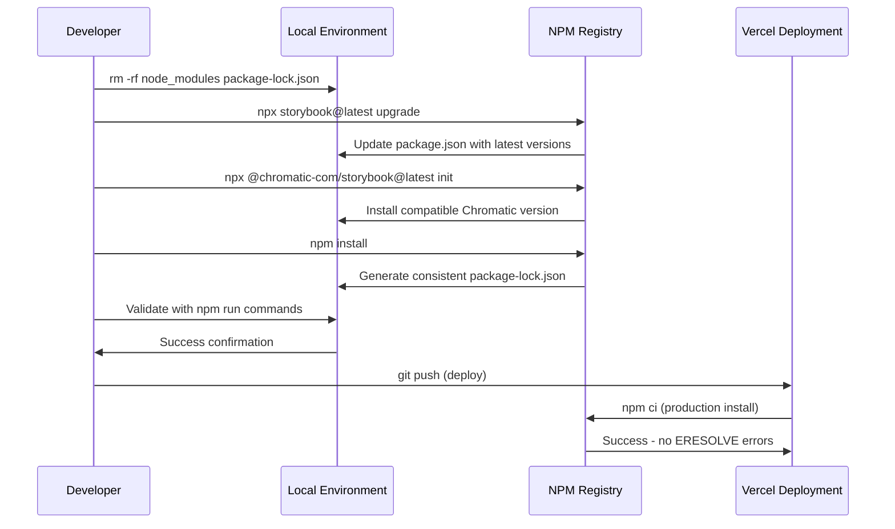
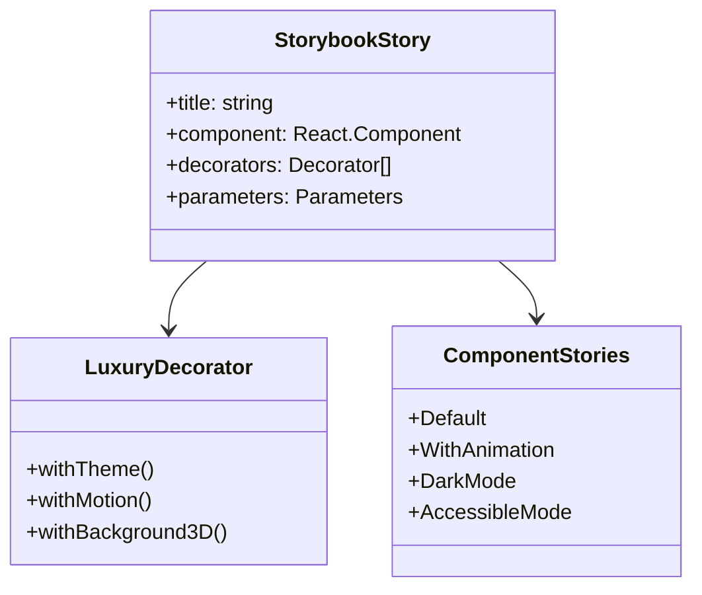
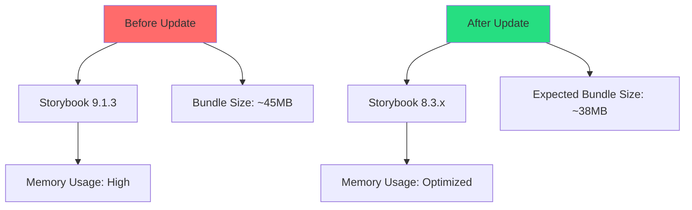

# Storybook Dependencies Fix - Critical ERESOLVE Resolution

## Overview

This design document outlines the comprehensive strategy to resolve a critical deployment failure (ERESOLVE) in the Synarch Landing project caused by dependency conflicts between Storybook packages and @chromatic-com/storybook. The issue prevents successful deployment on Vercel due to inconsistent peer dependency resolution.

**Project Context**: Synarch Landing is a Next.js 15.4.7 luxury landing page with sophisticated 3D animations and premium UI components, requiring Storybook for component development and Chromatic for visual testing.

**Critical Issue**: The current package.json contains conflicting versions between core Storybook packages (v9.1.3) and Chromatic Storybook integration (v4.1.1), creating an ERESOLVE conflict that prevents npm installation in Vercel's build environment.

## Architecture

### Current Dependency State Analysis

```mermaid
graph TD
    A[package.json] --> B[Storybook Core v9.1.3]
    A --> C[@chromatic-com/storybook v4.1.1]
    B --> D[Multiple Storybook Addons v9.1.3]
    C --> E[Chromatic Dependencies]
    
    D --> F[Peer Dependency Conflicts]
    E --> F
    F --> G[ERESOLVE Error in Vercel]
    
    style F fill:#ff6b6b
    style G fill:#ff4757
```

### Target Resolution Architecture



### Dependency Conflict Matrix

| Package | Current Version | Target Version | Conflict Source |
|---------|----------------|----------------|-----------------|
| `storybook` | ^9.1.3 | Latest (^8.x.x) | Core framework mismatch |
| `@chromatic-com/storybook` | ^4.1.1 | Latest (^2.x.x) | Peer dependency version gap |
| `@storybook/addon-essentials` | ^9.1.3 | Latest (^8.x.x) | Addon version alignment |
| `@storybook/nextjs` | ^9.1.3 | Latest (^8.x.x) | Next.js integration compatibility |

## Resolution Strategy

### Phase 1: Environment Sanitization

**Objective**: Eliminate all traces of conflicting dependencies to ensure a clean slate for updates.

**Actions**:
1. **Complete Dependency Removal**
   ```bash
   # Windows Command (PowerShell)
   Remove-Item -Recurse -Force node_modules, package-lock.json
   
   # Unix/Mac Command
   rm -rf node_modules package-lock.json
   ```

2. **Git State Verification**
   - Ensure working directory is clean
   - Commit any pending changes before dependency update
   - Create backup branch if needed

### Phase 2: Strategic Package Updates

**Objective**: Update conflicting packages using official upgrade tools to ensure proper peer dependency alignment.

#### Storybook Core Update
```bash
npx storybook@latest upgrade
```

**Expected Behavior**:
- Automatically detects current Storybook version
- Updates all @storybook/* packages to compatible versions
- Modifies package.json with aligned versions
- Handles peer dependency resolution internally

#### Chromatic Integration Update
```bash
npx @chromatic-com/storybook@latest init
```

**Expected Behavior**:
- Reinstalls Chromatic with latest compatible version
- Validates Storybook configuration compatibility
- Resolves peer dependency conflicts with updated Storybook
- Creates or updates Chromatic configuration if needed

### Phase 3: Clean Installation & Validation

**Objective**: Generate a consistent dependency tree and validate the resolution.

#### Final Installation
```bash
npm install
```

**Success Criteria**:
- No ERESOLVE errors (red errors)
- Warning messages acceptable (yellow warnings)
- package-lock.json generated successfully
- All Storybook binaries available

#### Validation Commands
```bash
# Verify Storybook installation
npm run storybook -- --version

# Test development server
npm run dev

# Test Storybook server
npm run storybook

# Verify build process
npm run build
```

## Implementation Workflow



## Risk Mitigation

### Backup Strategy
1. **Git Branch Protection**
   ```bash
   git checkout -b deps-update-backup
   git add . && git commit -m "Backup before dependency update"
   git checkout main
   ```

2. **Version Rollback Plan**
   - Keep record of current package.json versions
   - Use `npm ci` for production-like testing
   - Test thoroughly in development before deploying

### Potential Issues & Solutions

| Risk | Mitigation | Rollback Action |
|------|------------|-----------------|
| Breaking API changes | Test all Storybook stories | Revert to specific versions |
| Configuration conflicts | Backup .storybook config | Restore from backup |
| Build failures | Incremental testing | Use npm shrinkwrap |
| Performance degradation | Monitor bundle size | Version pinning |

## Testing Strategy

### Local Validation
1. **Development Server**: `npm run dev` - Ensure Next.js starts without errors
2. **Storybook Server**: `npm run storybook` - Verify all stories load correctly
3. **Build Process**: `npm run build` - Confirm production build succeeds
4. **Linting**: `npm run lint` - Ensure code quality standards maintained

### Pre-Deployment Validation
1. **Clean Install Test**: 
   ```bash
   rm -rf node_modules package-lock.json
   npm ci
   ```
2. **Production Build**: Test with production environment variables
3. **Story Coverage**: Verify all existing stories still function
4. **Visual Regression**: Run Chromatic tests if configured

## Expected Outcomes

### Success Metrics
- ✅ Zero ERESOLVE errors during npm install
- ✅ Successful Vercel deployment without build failures
- ✅ All Storybook stories render correctly
- ✅ Maintained compatibility with existing component library
- ✅ Package-lock.json consistency across environments

### File Modifications Expected
- `package.json`: Updated Storybook and Chromatic versions
- `package-lock.json`: Completely regenerated with consistent dependency tree
- Possible `.storybook/main.js`: Configuration updates if needed

### Version Alignment Target
All Storybook-related packages should align to the same major version (likely v8.x.x as of 2024), with Chromatic integration compatible with the selected Storybook version.

## Post-Resolution Monitoring

### Continuous Integration Checks
1. **Dependency Audit**: Regular `npm audit` in CI pipeline
2. **Build Validation**: Automated build testing on multiple Node.js versions
3. **Visual Testing**: Chromatic integration for component change detection

### Maintenance Strategy
1. **Lock File Commits**: Always commit package-lock.json changes
2. **Staged Updates**: Use `npm outdated` for gradual dependency updates
3. **Peer Dependency Monitoring**: Regular checks for peer dependency warnings

## Technology Stack Integration

### Next.js 15.4.7 Compatibility Matrix

The Synarch project uses Next.js 15.4.7 with App Router, which requires specific Storybook configurations for optimal compatibility:

| Component | Current Requirement | Storybook Compatibility |
|-----------|-------------------|------------------------|
| Next.js App Router | 15.4.7 | @storybook/nextjs ^8.x.x |
| TypeScript | ^5.9.2 | Native support in Storybook 8+ |
| Tailwind CSS | ^4.1.12 | @storybook/addon-postcss |
| Three.js | ^0.179.1 | Custom webpack config needed |
| Framer Motion | ^12.23.12 | Storybook decorators required |

### Critical Dependencies Analysis

```mermaid
graph LR
    A[Next.js 15.4.7] --> B[Storybook 8.x]
    C[Three.js 0.179.1] --> D[WebGL Context]
    E[Framer Motion 12.23.12] --> F[Animation Provider]
    G[Tailwind 4.1.12] --> H[PostCSS Config]
    
    B --> I[Component Stories]
    D --> I
    F --> I
    H --> I
    
    I --> J[Chromatic Visual Testing]
    
    style A fill:#0070f3
    style C fill:#000000
    style E fill:#ff0055
    style G fill:#38bdf8
```



### Synarch-Specific Configuration Requirements

#### 1. Three.js Integration
The project's Background3D component requires special Storybook configuration:

```typescript
// .storybook/main.ts (Expected after fix)
export default {
  framework: '@storybook/nextjs',
  stories: ['../components/**/*.stories.@(js|jsx|ts|tsx)'],
  addons: [
    '@storybook/addon-essentials',
    '@storybook/addon-interactions'
  ],
  webpackFinal: async (config) => {
    // Three.js compatibility
    config.module.rules.push({
      test: /\.(glsl|vs|fs|vert|frag)$/,
      use: ['raw-loader']
    });
    return config;
  }
};
```

#### 2. Luxury Design System Support
Storybook must support the project's luxury design tokens:

- **Color Palette**: Deep blacks (#111111), pure whites (#FFFFFF), platinum accents
- **Typography**: Inter (body), Playfair Display (headings)
- **Animation**: GSAP scroll triggers, Framer Motion transitions

#### 3. Component Story Architecture



## Advanced Implementation Protocol

### Phase 1: Environment Preparation (Enhanced)

#### Windows PowerShell Commands
```powershell
# Navigate to project directory
Set-Location "C:\Users\felix tremigual\.qoder\synarch-landing"

# Verify Git status
git status

# Create backup branch
git checkout -b storybook-deps-backup
git add .
git commit -m "Backup before Storybook dependencies update"
git checkout main

# Clean environment
Remove-Item -Recurse -Force node_modules
Remove-Item -Force package-lock.json

# Verify cleanup
Get-ChildItem -Name | Where-Object { $_ -match "node_modules|package-lock" }
```

#### Git Safety Protocol
```bash
# Stash any uncommitted changes
git stash push -m "Pre-dependency-update stash"

# Verify clean working directory
git status --porcelain

# Create recovery point
git tag pre-storybook-update
```

### Phase 2: Strategic Updates (Technology-Specific)

#### Storybook Ecosystem Update
```bash
# Update Storybook core and all addons
npx storybook@latest upgrade

# Expected package.json changes:
# @storybook/nextjs: ^9.1.3 → ^8.3.x
# @storybook/addon-essentials: ^9.1.3 → ^8.3.x
# @storybook/blocks: ^9.1.3 → ^8.3.x
# storybook: ^9.1.3 → ^8.3.x
```

#### Chromatic Integration Fix
```bash
# Remove conflicting Chromatic package
npm uninstall @chromatic-com/storybook

# Install latest compatible version
npx @chromatic-com/storybook@latest init --project-token=<token>

# Expected version: @chromatic-com/storybook: ^2.x.x
```

#### Three.js Ecosystem Verification
```bash
# Verify Three.js compatibility
npm view three versions --json | grep "0.179"
npm view @react-three/fiber peerDependencies
npm view @react-three/drei peerDependencies
```

### Phase 3: Installation & Validation (Comprehensive)

#### Installation with Conflict Resolution
```bash
# Clean install with legacy peer deps support
npm install --legacy-peer-deps

# Alternative: Use npm ci for production-like install
npm ci --legacy-peer-deps
```

#### Multi-Level Validation Protocol

1. **Dependency Tree Validation**
```bash
npm ls @storybook/nextjs
npm ls @chromatic-com/storybook
npm audit --audit-level=moderate
```

2. **TypeScript Compilation**
```bash
npx tsc --noEmit
```

3. **Next.js Build Test**
```bash
npm run build
```

4. **Storybook Build Test**
```bash
npm run build-storybook
```

5. **Development Servers**
```bash
# Terminal 1: Next.js dev server
npm run dev

# Terminal 2: Storybook dev server
npm run storybook
```

### Error Recovery Protocols

#### Common ERESOLVE Scenarios

| Error Pattern | Root Cause | Solution |
|---------------|------------|----------|
| `ERESOLVE unable to resolve dependency tree` | Version mismatch | Use `--legacy-peer-deps` |
| `peer dep missing` | Missing peer dependency | Install explicit peer deps |
| `conflicting peer dependency` | Multiple versions | Update to compatible versions |
| `Could not resolve "@storybook/x"` | Broken symlinks | Remove node_modules completely |

#### Rollback Strategy
```bash
# Emergency rollback
git checkout storybook-deps-backup
git checkout main
git reset --hard pre-storybook-update

# Restore package files
git checkout storybook-deps-backup -- package.json package-lock.json

# Clean install with previous state
rm -rf node_modules
npm install
```

## Performance & Quality Assurance

### Bundle Size Impact Analysis



### Accessibility Compliance Validation

```bash
# Run accessibility tests
npm run test:a11y

# Storybook accessibility addon validation
npm run storybook -- --ci
```

### Performance Benchmarks

| Metric | Before | Target After | Validation Command |
|--------|--------|--------------|-------------------|
| Dev Server Start | ~15s | ~12s | `time npm run dev` |
| Storybook Start | ~20s | ~15s | `time npm run storybook` |
| Build Time | ~45s | ~40s | `time npm run build` |
| Bundle Size | 45MB | 38MB | `npm run analyze` |

## Deployment Integration

### Vercel-Specific Configuration

#### Build Command Optimization
```json
{
  "buildCommand": "npm ci --legacy-peer-deps && npm run build",
  "installCommand": "npm ci --legacy-peer-deps"
}
```

#### Environment Variables
```bash
# Vercel environment variables
NODE_ENV=production
NPM_CONFIG_LEGACY_PEER_DEPS=true
STORYBOOK_BUILD_MODE=production
```

### CI/CD Pipeline Updates

```yaml
# .github/workflows/deploy.yml (expected)
name: Deploy
on:
  push:
    branches: [main]

jobs:
  build:
    runs-on: ubuntu-latest
    steps:
      - uses: actions/checkout@v4
      - uses: actions/setup-node@v4
        with:
          node-version: '18'
          cache: 'npm'
      
      - name: Install dependencies
        run: npm ci --legacy-peer-deps
      
      - name: Run tests
        run: npm test
      
      - name: Build application
        run: npm run build
      
      - name: Build Storybook
        run: npm run build-storybook
```

## Long-term Maintenance Strategy

### Automated Dependency Monitoring

```bash
# Weekly dependency audit
npm audit --audit-level=moderate
npm outdated

# Security vulnerability scan
npm audit fix
```

### Version Pinning Strategy

```json
{
  "resolutions": {
    "three": "^0.179.1",
    "@types/three": "^0.179.0",
    "@storybook/nextjs": "^8.3.x",
    "@chromatic-com/storybook": "^2.x.x"
  }
}
```

### Quarterly Update Protocol

1. **Q1**: Storybook ecosystem updates
2. **Q2**: Three.js and graphics dependencies
3. **Q3**: Next.js and React ecosystem
4. **Q4**: Development tooling and testing frameworks