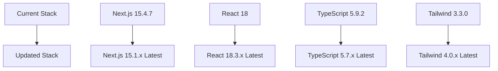
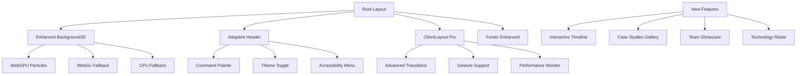
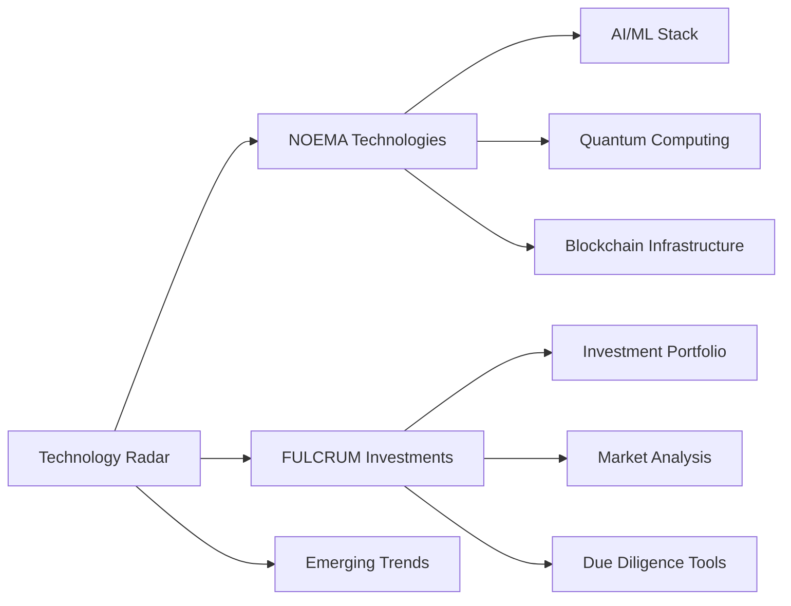
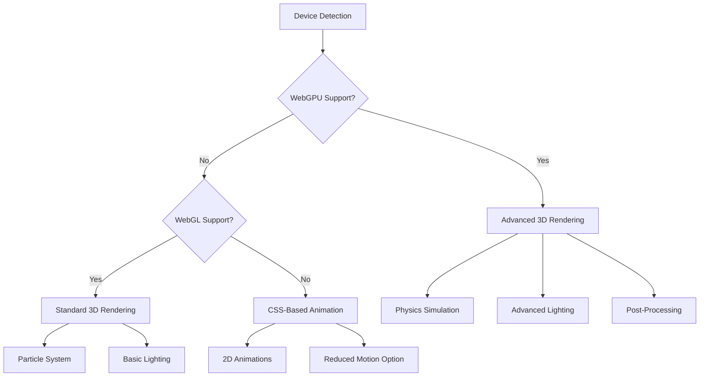
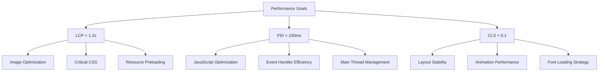
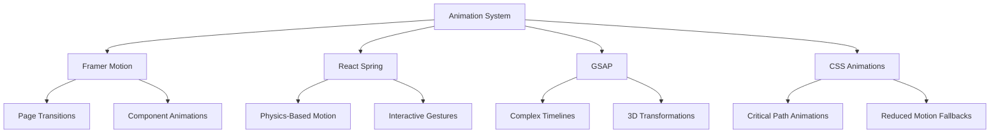
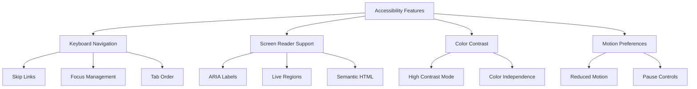
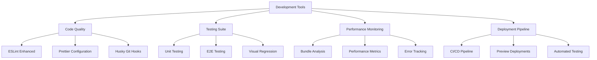
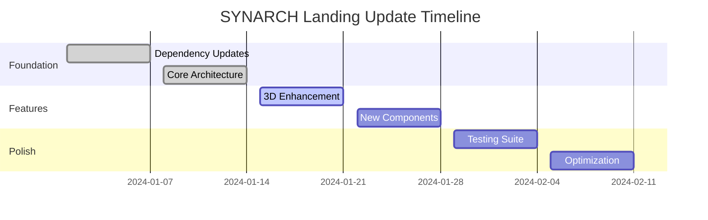

# SYNARCH Landing Page - Comprehensive Update Design

## Overview

This design document outlines a comprehensive update strategy for the SYNARCH landing page, focusing on modernizing dependencies, enhancing performance, improving user experience, and adding new features while maintaining the brand's minimalist "Silent Power" aesthetic.

**Current State Analysis:**
- Next.js 15.4.7 with App Router
- React 18 with concurrent features
- Framer Motion 12.23.12 for animations
- Three.js 0.179.1 for 3D backgrounds
- TypeScript 5.9.2
- Tailwind CSS 3.3.0

**Update Goals:**
- Upgrade to latest stable versions of all dependencies
- Enhance performance and accessibility
- Add new interactive features
- Improve SEO and Core Web Vitals
- Implement advanced animation patterns
- Add progressive enhancement capabilities

## Technology Stack & Dependencies Update

### Core Framework Updates



**Dependency Upgrade Strategy:**

1. **Next.js Framework**
   - Upgrade to Next.js 15.1.x (latest stable)
   - Utilize new App Router enhancements
   - Implement Turbopack for faster development
   - Add React Server Components optimizations

2. **Animation Libraries**
   - Framer Motion: Upgrade to latest 12.x
   - GSAP: Upgrade to 3.14.x with enhanced performance
   - Add React Spring as alternative animation library
   - Implement CSS-based animations for critical path

3. **3D Graphics Enhancement**
   - Three.js: Upgrade to 0.185.x
   - Add Three.js Drei for enhanced utilities
   - Implement WebGPU support with fallback
   - Add React Three Fiber integration

4. **Styling & UI Updates**
   - Tailwind CSS: Upgrade to 4.0.x
   - Add Headless UI components
   - Implement CSS Container Queries
   - Add design tokens system

### New Dependencies Integration

```json
{
  "dependencies": {
    "@headlessui/react": "^2.2.x",
    "@react-three/fiber": "^8.x",
    "@react-three/drei": "^9.x",
    "react-spring": "^9.7.x",
    "vaul": "^1.x",
    "cmdk": "^1.x",
    "lucide-react": "^0.x"
  },
  "devDependencies": {
    "@next/bundle-analyzer": "^15.x",
    "prettier": "^3.x",
    "husky": "^9.x",
    "lint-staged": "^15.x"
  }
}
```

## Architecture Enhancement

### Component Architecture Redesign



### Enhanced Layout System

**1. Adaptive Layout Architecture**
- Implement container queries for responsive design
- Add viewport-based component loading
- Create adaptive component variants
- Implement dynamic grid systems

**2. Performance-First Architecture**
- Server-side rendering optimization
- Selective hydration patterns
- Progressive enhancement strategy
- Critical resource prioritization

**3. Accessibility-First Design**
- Screen reader optimization
- Keyboard navigation enhancement
- Focus management system
- Reduced motion preferences

## New Features & Components

### 1. Interactive Technology Radar



**Implementation Details:**
- Interactive D3.js visualization
- Real-time data integration
- Responsive SVG graphics
- Accessibility-compliant interactions
- Mobile gesture support

### 2. Enhanced 3D Background System

**WebGPU Implementation:**
- Primary rendering engine for supported browsers
- Enhanced particle systems with physics
- Real-time lighting effects
- Advanced post-processing pipeline

**Progressive Enhancement:**


### 3. Command Palette Integration

**Features:**
- Quick navigation (Cmd/Ctrl + K)
- Search functionality
- Action shortcuts
- Accessibility compliance
- Theme switching
- Language selection

### 4. Case Studies Gallery

**Interactive Showcase:**
- Portfolio of SYNARCH entities
- Success stories visualization
- Technology deep-dives
- Investment outcomes
- Partnership highlights

### 5. Team & Leadership Showcase

**Professional Profiles:**
- Leadership team presentation
- Advisor network
- Technical team highlights
- Board of directors
- Strategic partnerships

## Performance Optimization Strategy

### Core Web Vitals Enhancement



### Advanced Optimization Techniques

**1. Resource Loading Strategy**
- Critical resource prioritization
- Adaptive loading based on connection
- Intelligent prefetching
- Service worker implementation

**2. Code Splitting Enhancement**
- Route-based splitting
- Component-based splitting
- Dynamic imports optimization
- Bundle analysis and optimization

**3. Rendering Optimization**
- Server Components maximization
- Client hydration optimization
- Streaming SSR implementation
- Edge runtime utilization

## Animation System Upgrade

### Multi-Library Animation Architecture



### Advanced Animation Patterns

**1. Gesture-Driven Interactions**
- Touch and mouse gesture recognition
- Physics-based response system
- Momentum and spring animations
- Multi-touch support

**2. Scroll-Driven Animations**
- Intersection Observer optimization
- Progressive disclosure patterns
- Parallax effects enhancement
- Scroll-synchronized animations

**3. Adaptive Animation System**
- Device capability detection
- Performance-based adjustment
- User preference respect
- Battery-aware animations

## SEO & Accessibility Enhancement

### SEO Optimization Strategy

**Technical SEO:**
- Enhanced structured data (JSON-LD)
- Open Graph optimization
- Twitter Card implementation
- Canonical URL management
- Sitemap generation
- Robot.txt optimization

**Content SEO:**
- Semantic HTML enhancement
- Heading hierarchy optimization
- Alt text generation
- Meta description optimization
- Schema markup implementation

### Accessibility Compliance (WCAG 2.2 AA)



## Security & Privacy Enhancement

### Security Measures

**1. Content Security Policy (CSP)**
- Strict CSP implementation
- Nonce-based script loading
- Resource integrity checks
- XSS prevention measures

**2. Privacy Compliance**
- GDPR compliance implementation
- Cookie consent management
- Data minimization practices
- Privacy policy integration

**3. Performance Security**
- Rate limiting implementation
- DDoS protection
- Bot detection
- Secure headers configuration

## Development Experience Enhancement

### Developer Tools Integration



### Quality Assurance Framework

**1. Testing Strategy**
- Jest for unit testing
- Playwright for E2E testing
- Storybook for component testing
- Chromatic for visual regression

**2. Code Quality Tools**
- Enhanced ESLint configuration
- Prettier code formatting
- TypeScript strict mode
- Import sorting automation

**3. Performance Monitoring**
- Core Web Vitals tracking
- Real User Monitoring (RUM)
- Error boundary implementation
- Analytics integration

## Implementation Roadmap

### Phase 1: Foundation Update (Week 1-2)
- Dependency upgrades
- Core architecture enhancement
- Performance baseline establishment
- Security implementation

### Phase 2: Feature Development (Week 3-4)
- New component development
- Animation system upgrade
- 3D background enhancement
- Command palette integration

### Phase 3: Content & Polish (Week 5-6)
- Case studies implementation
- Team showcase development
- SEO optimization
- Accessibility compliance

### Phase 4: Testing & Optimization (Week 7-8)
- Comprehensive testing suite
- Performance optimization
- Cross-browser compatibility
- Final polish and deployment

## Migration Strategy

### Gradual Migration Approach



### Risk Mitigation

**1. Backward Compatibility**
- Feature flag implementation
- Graceful degradation patterns
- Progressive enhancement approach
- Rollback strategies

**2. Performance Monitoring**
- Real-time performance tracking
- A/B testing framework
- User feedback collection
- Continuous optimization

**3. Quality Assurance**
- Automated testing pipeline
- Manual testing protocols
- Cross-device compatibility
- Accessibility validation