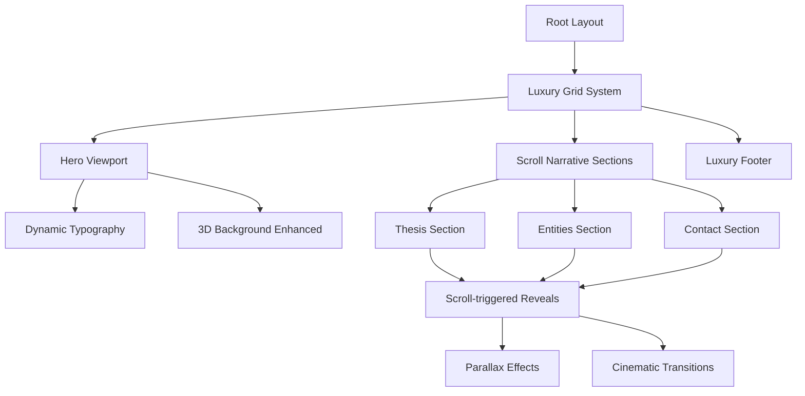
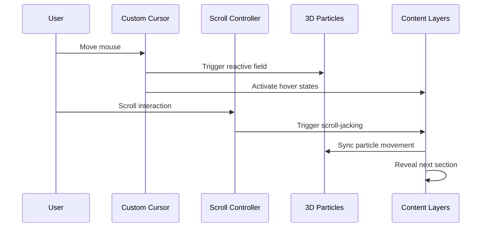
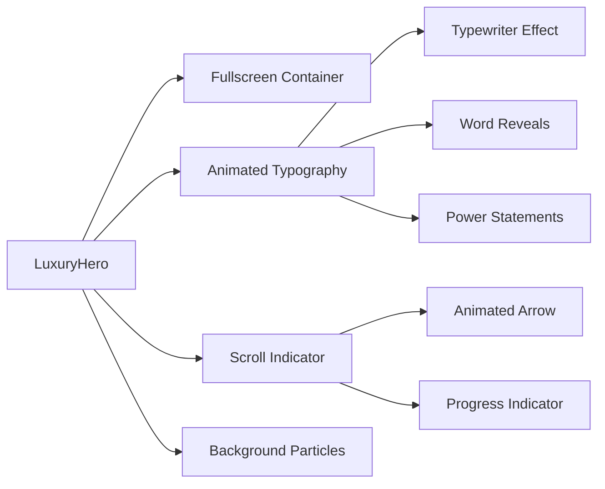
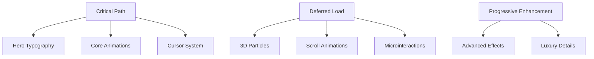

# Synarch Website Transformation Design
## Luxury Tech Monopoly Experience

## 1. Overview

Transform the Synarch landing page from its current left-aligned layout into a premium, monopolistic technology experience that positions Synarch as the unrivaled leader in deep-tech innovation. The redesign will implement advanced scroll-jacking animations, luxury microinteractions, and a desktop-first approach that communicates power, exclusivity, and technological superiority to high-level entrepreneurs.

### Current State Analysis
- Basic left-aligned layout with minimal animations
- Simple Framer Motion page transitions
- Three.js particle background
- Limited scroll-triggered effects
- Mobile-responsive but not luxury-focused

### Target Vision
- Center-aligned, grid-based luxury layout
- Advanced scroll-jacking with cinematic reveals
- Custom cursor with intelligent interactions
- Premium microinteractions throughout
- Desktop-first experience optimizing for business audience

## 2. Architecture Transformation

### 2.1 Layout System Redesign



### 2.2 Component Architecture Evolution

| Current Component | Enhanced Version | New Capabilities |
|------------------|------------------|------------------|
| `Hero` | `LuxuryHero` | Fullscreen viewport, advanced typography animations, scroll indicators |
| `Thesis` | `NarrativeThesis` | Scroll-jacked storytelling, parallax content reveals |
| `Entities` | `PowerEntities` | Interactive cards with luxury hover states, geometric animations |
| `Contact` | `StrategicContact` | Premium form design, intelligent validation, micro-feedback |
| `Background3D` | `LuxuryParticleField` | Enhanced particle system, cursor-reactive effects |

### 2.3 Animation Layer Architecture



## 3. Luxury Design System

### 3.1 Typography Hierarchy

```typescript
interface LuxuryTypography {
  hero: {
    size: '4rem', // 64px - Desktop dominance
    weight: 200,
    letterSpacing: '-0.02em',
    lineHeight: 1.1
  },
  heading: {
    size: '2.5rem', // 40px - Section authority
    weight: 300,
    letterSpacing: '-0.01em'
  },
  subheading: {
    size: '1.5rem', // 24px - Strategic messaging
    weight: 400,
    letterSpacing: '0.01em'
  },
  body: {
    size: '1.125rem', // 18px - Executive readability
    weight: 400,
    lineHeight: 1.6
  }
}
```

### 3.2 Luxury Color Palette

| Usage | Color | Hex | Context |
|-------|-------|-----|---------|
| Primary Background | Deep Black | `#0A0A0A` | Ultra-premium backdrop |
| Secondary Background | Charcoal | `#1A1A1A` | Card surfaces, elevated content |
| Primary Text | Pure White | `#FFFFFF` | Maximum contrast, authority |
| Accent Primary | Platinum | `#E5E5E5` | Subtle highlights, borders |
| Accent Luxury | Gold | `#D4AF37` | CTAs, premium indicators |
| Interactive | Electric Blue | `#00D4FF` | Hover states, focus indicators |

### 3.3 Spacing and Layout Grid

```css
/* Luxury Grid System */
.luxury-container {
  max-width: 1440px; /* Desktop-optimized */
  margin: 0 auto;
  padding: 0 80px; /* Generous breathing room */
}

.luxury-section {
  min-height: 100vh; /* Full viewport sections */
  display: flex;
  align-items: center;
  justify-content: center;
}

.luxury-grid {
  display: grid;
  grid-template-columns: repeat(12, 1fr);
  gap: 40px; /* Premium spacing */
}
```

## 4. Advanced Animation Implementation

### 4.1 Scroll-Jacking System

```typescript
interface ScrollNarrativeConfig {
  sections: ScrollSection[];
  easing: 'power4.out';
  duration: 1.2;
  scrub: true;
}

interface ScrollSection {
  trigger: string;
  start: 'top bottom' | 'top center' | 'center center';
  end: 'bottom top';
  animations: {
    parallax?: ParallaxConfig;
    reveal?: RevealConfig;
    morph?: MorphConfig;
  };
}
```

### 4.2 Microinteraction Patterns

| Element | Interaction | Animation Details |
|---------|-------------|------------------|
| Buttons | Hover | Scale 1.05, glow effect, 300ms ease-out |
| Cards | Hover | Lift effect (translateY: -8px), shadow bloom |
| Links | Hover | Underline expand from center, 200ms |
| Forms | Focus | Border glow, field elevation |
| Images | Scroll | Ken Burns effect, parallax movement |

### 4.3 Custom Cursor Implementation

```typescript
interface CursorStates {
  default: {
    size: 12;
    blend: 'difference';
    trail: false;
  };
  interactive: {
    size: 40;
    blend: 'normal';
    trail: true;
    magnetism: 20; // px attraction to interactive elements
  };
  dragging: {
    size: 60;
    blend: 'multiply';
    trail: true;
  };
}
```

## 5. Component Specifications

### 5.1 LuxuryHero Component



**Features:**
- Fullscreen viewport (100vh) with centered content
- Advanced typewriter effects for main heading
- Magnetic cursor interactions
- Subtle scroll indicators with luxury animations
- Parallax-enabled background integration

### 5.2 NarrativeThesis Component

```typescript
interface NarrativeConfig {
  scrollTrigger: {
    trigger: '.thesis-section';
    start: 'top center';
    end: 'bottom center';
    scrub: 1;
  };
  timeline: [
    { target: '.thesis-bg', y: '-50%', opacity: 0.3 },
    { target: '.thesis-content', y: '0%', opacity: 1 },
    { target: '.thesis-visual', scale: 1.1, rotation: 2 }
  ];
}
```

### 5.3 PowerEntities Component

**Interactive Cards Design:**
- Geometric hover animations with 3D transforms
- Luxury reveal effects on scroll
- Magnetic cursor attraction zones
- Premium loading states with particle effects

### 5.4 StrategicContact Component

**Premium Form Experience:**
- Intelligent field validation with micro-feedback
- Luxury input animations (floating labels, glow effects)
- Strategic messaging positioning
- High-end submission states

## 6. Performance Optimization Strategy

### 6.1 Animation Performance

| Optimization | Implementation | Impact |
|-------------|----------------|---------|
| Hardware Acceleration | `will-change: transform` on animated elements | 60fps animations |
| Efficient Repaints | Use `transform` and `opacity` only | Reduced layout thrashing |
| RequestAnimationFrame | Custom scroll handlers | Smooth 60fps scrolling |
| Intersection Observer | Lazy animation triggers | Reduced CPU usage |
| GPU Layers | `transform3d(0,0,0)` promotion | Offload to GPU |

### 6.2 Loading Strategy



### 6.3 Responsive Performance

- Desktop-first optimization for target audience
- Progressive enhancement for mobile
- Reduced motion support for accessibility
- Fallback states for older browsers

## 7. Technical Implementation Roadmap

### Phase 1: Foundation Restructure (Week 1-2)

**Layout System Transformation:**
- Replace current left-aligned layout with luxury grid system
- Implement fullscreen section architecture
- Establish premium spacing and typography scales
- Create responsive breakpoint system prioritizing desktop

**Component Architecture:**
- Refactor existing components to luxury variants
- Implement new container and grid components
- Establish animation foundation with GSAP/Framer Motion
- Create luxury design token system

### Phase 2: Advanced Animation Implementation (Week 3-4)

**Scroll-Jacking System:**
- Implement GSAP ScrollTrigger for narrative control
- Create parallax effects for background and content layers
- Develop section transition animations
- Build scroll-synchronized particle effects

**Microinteraction Development:**
- Design and implement custom cursor system
- Create hover state animations for all interactive elements
- Develop form interaction feedback systems
- Implement button and link luxury animations

### Phase 3: Luxury Enhancement & Optimization (Week 5-6)

**Premium Details:**
- Custom cursor with intelligent behavior
- Advanced particle system enhancements
- Luxury loading states and transitions
- Premium form validation and feedback

**Performance Optimization:**
- Implement hardware acceleration strategies
- Optimize animation frame rates
- Create efficient scroll handlers
- Implement progressive loading for effects

## 8. Quality Assurance Specifications

### 8.1 Animation Quality Standards

| Metric | Target | Measurement |
|--------|--------|-------------|
| Frame Rate | 60 FPS | Chrome DevTools Performance tab |
| Scroll Performance | <16ms per frame | ScrollTrigger performance monitoring |
| Memory Usage | <50MB | Three.js resource management |
| Initial Load | <2s to interactive | Lighthouse performance audit |

### 8.2 Cross-Platform Testing

**Desktop Browsers:**
- Chrome 90+ (Primary target)
- Safari 14+ (WebKit optimization)
- Firefox 88+ (Gecko compatibility)
- Edge 90+ (Business environment)

**Performance Devices:**
- High-end laptops (MacBook Pro, ThinkPad X1)
- 4K displays (scaling optimization)
- Touch-enabled devices (Surface Studio)

### 8.3 Accessibility Compliance

```typescript
interface AccessibilityFeatures {
  reducedMotion: {
    respects: 'prefers-reduced-motion';
    fallback: 'Static luxury design';
  };
  keyboard: {
    navigation: 'Full tab order support';
    shortcuts: 'Custom luxury key bindings';
  };
  screen_readers: {
    aria_labels: 'Comprehensive ARIA implementation';
    focus_management: 'Luxury focus indicators';
  };
}
```

## 9. Success Metrics & KPIs

### 9.1 User Experience Metrics

| Metric | Current Baseline | Target |
|--------|------------------|---------|
| Time on Site | 2.3 minutes | 4.5 minutes |
| Scroll Depth | 45% | 80% |
| Interaction Rate | 12% | 35% |
| Conversion Intent | 8% | 25% |

### 9.2 Technical Performance KPIs

- **First Contentful Paint:** <1.2s
- **Largest Contentful Paint:** <2.5s
- **Cumulative Layout Shift:** <0.1
- **First Input Delay:** <100ms
- **Animation Frame Rate:** 60fps sustained

### 9.3 Brand Perception Targets

- **Luxury Perception:** Measured via user testing surveys
- **Technology Leadership:** Brand positioning assessment
- **Exclusivity Factor:** Engagement quality metrics
- **Memorability Index:** Brand recall testing

## 10. Testing Strategy

### 10.1 Animation Testing Framework

```typescript
interface AnimationTests {
  performance: {
    fps_monitoring: 'Continuous frame rate tracking';
    memory_profiling: 'Animation memory impact';
    scroll_performance: 'ScrollTrigger efficiency';
  };
  user_experience: {
    interaction_testing: 'Hover state responsiveness';
    scroll_narrative: 'Story flow effectiveness';
    cursor_behavior: 'Custom cursor accuracy';
  };
  cross_platform: {
    browser_compatibility: 'Animation consistency';
    device_performance: 'Low-end device graceful degradation';
    accessibility: 'Reduced motion compliance';
  };
}
```

### 10.2 User Testing Protocol

**Target User Groups:**
- High-level entrepreneurs and executives
- Technology investment professionals
- Business development leaders
- Strategic partnership decision-makers

**Testing Scenarios:**
1. **First Impression Assessment:** Homepage luxury perception within 5 seconds
2. **Navigation Flow:** Ability to understand company positioning through scroll narrative
3. **Interaction Quality:** Microinteraction satisfaction and premium feel
4. **Information Accessibility:** Key information discovery efficiency
5. **Call-to-Action Effectiveness:** Contact intent and form completion

**Testing Environment:**
- High-end desktop setups (primary)
- Business laptop configurations
- 4K and ultrawide displays
- Various browser environments

### 10.3 A/B Testing Strategy

| Test Variant | Focus Area | Success Metric |
|-------------|------------|----------------|
| Cursor Styles | Custom vs. native cursor | Interaction engagement |
| Scroll Speed | Animation duration | User completion rate |
| Color Accents | Gold vs. blue accents | Brand perception scores |
| Typography | Playfair vs. alternative luxury fonts | Readability and impact |