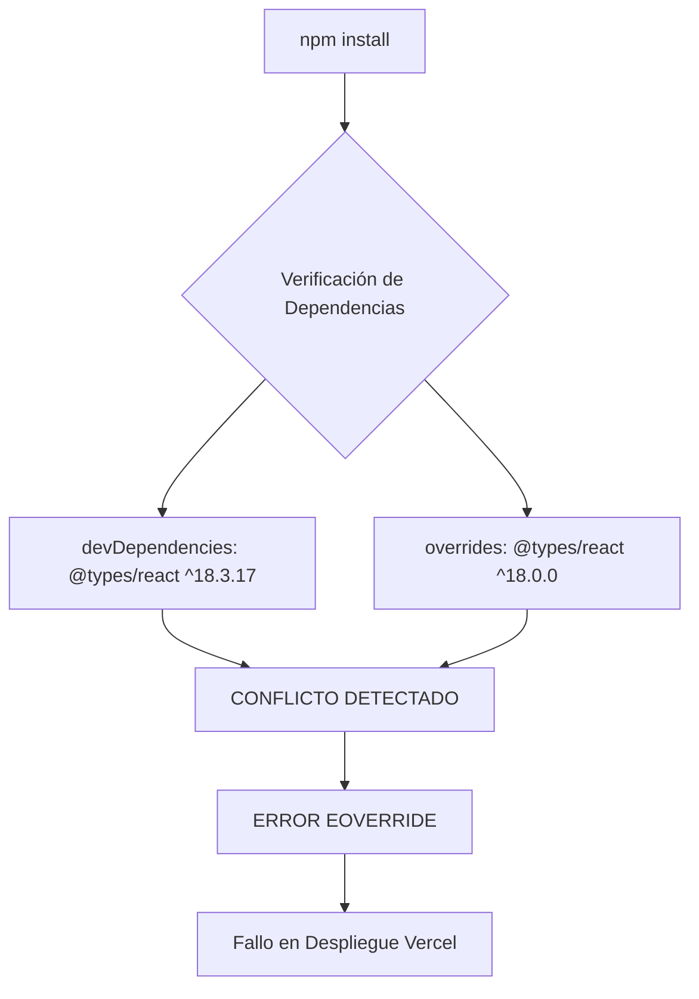
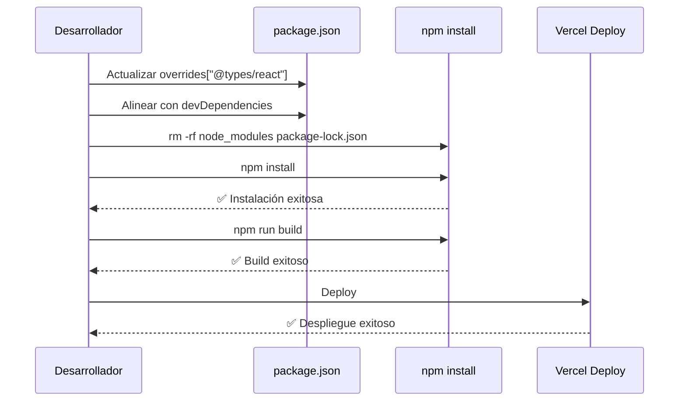
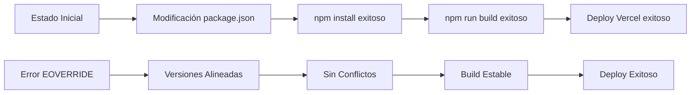

# Resolución Crítica del Error EOVERRIDE en Despliegue Vercel

## Descripción General

### Problema Identificado
Error crítico EOVERRIDE durante `npm install` en Vercel (commit ca486f8) causado por conflicto entre las versiones de `@types/react` declaradas en `devDependencies` y `overrides` del archivo `package.json`.

### Estado Actual de Conflicto
```json
{
  "devDependencies": {
    "@types/react": "^18.3.17"
  },
  "overrides": {
    "@types/react": "^18.0.0"
  }
}
```

### Objetivo de la Resolución
Alinear las versiones de `@types/react` en ambas secciones para eliminar el conflicto de dependencias y permitir un despliegue exitoso en Vercel.

## Arquitectura de la Solución

### Análisis del Conflicto



### Estrategia de Alineación

#### Opción 1: Alineación a Versión Específica (Recomendada)
```json
{
  "devDependencies": {
    "@types/react": "^18.3.17"
  },
  "overrides": {
    "@types/react": "^18.3.17"
  }
}
```

#### Opción 2: Alineación a Rango Compatible
```json
{
  "devDependencies": {
    "@types/react": "^18.3.17"
  },
  "overrides": {
    "@types/react": "^18.3.0"
  }
}
```

### Flujo de Resolución



## Especificaciones Técnicas de Implementación

### Modificación del package.json

#### Archivo de Configuración Objetivo
```json
{
  "name": "synarch-landing",
  "version": "0.2.0",
  "private": true,
  "devDependencies": {
    "@types/react": "^18.3.17",
    "@types/react-dom": "^18.3.5"
  },
  "overrides": {
    "@types/react": "^18.3.17"
  },
  "resolutions": {
    "three": "^0.179.1",
    "@types/three": "^0.179.0"
  }
}
```

### Comandos de Ejecución

#### Secuencia de Limpieza y Reinstalación
```bash
# 1. Eliminar dependencias existentes
rm -rf node_modules package-lock.json

# 2. Reinstalar con configuración alineada
npm install

# 3. Verificar build
npm run build

# 4. Ejecutar pruebas (opcional)
npm run lint
```

### Validación de Dependencias

#### Verificación de Coherencia
```json
{
  "dependencies": {
    "react": "^18.3.1",
    "react-dom": "^18.3.1"
  },
  "devDependencies": {
    "@types/react": "^18.3.17",
    "@types/react-dom": "^18.3.5"
  },
  "overrides": {
    "@types/react": "^18.3.17"
  }
}
```

## Criterios de Éxito y Verificación

### Criterios de Validación Técnica

| Criterio | Comando de Verificación | Resultado Esperado |
|----------|------------------------|-------------------|
| Instalación Sin Errores | `npm install` | ✅ Sin errores EOVERRIDE/ERESOLVE |
| Integridad de Compilación | `npm run build` | ✅ Build exitoso sin errores de tipos |
| Consistencia de Lock File | `cat package-lock.json` | ✅ package-lock.json generado correctamente |
| Preparación para Despliegue | `npm run lint` | ✅ Sin errores de linting |

### Métricas de Éxito



## Impacto en el Sistema

### Componentes Afectados

#### Archivos de Configuración
- `package.json` - Modificación directa de overrides
- `package-lock.json` - Regeneración completa
- `node_modules/` - Reinstalación completa

#### Dependencias de Tipos TypeScript
- Alineación de tipos React en todo el proyecto
- Consistencia en definiciones de componentes
- Estabilidad en el sistema de tipos

### Compatibilidad del Ecosistema

#### Verificación de Compatibilidad de Versiones
```json
{
  "react": "^18.3.1",
  "@types/react": "^18.3.17",
  "next": "15.4.7",
  "typescript": "^5.9.2"
}
```

#### Matriz de Compatibilidad

| Paquete | Versión Actual | Versión Target | Compatibilidad |
|---------|---------------|----------------|----------------|
| react | ^18.3.1 | ^18.3.1 | ✅ Compatible |
| @types/react | ^18.3.17 | ^18.3.17 | ✅ Alineado |
| next | 15.4.7 | 15.4.7 | ✅ Compatible |
| typescript | ^5.9.2 | ^5.9.2 | ✅ Compatible |

## Pruebas de Validación

### Protocolo de Testing

#### Pruebas Locales
```bash
# 1. Verificación de instalación
npm install --verbose

# 2. Verificación de tipos
npx tsc --noEmit

# 3. Verificación de build
npm run build

# 4. Verificación de linting
npm run lint
```

#### Pruebas de Despliegue
```bash
# Simulación de entorno Vercel
NODE_ENV=production npm run build
```

### Casos de Prueba Específicos

| Caso de Prueba | Comando | Resultado Esperado |
|---------------|---------|-------------------|
| Instalación Limpia | `npm ci` | Sin errores EOVERRIDE |
| Build de Producción | `npm run build` | Build exitoso |
| Verificación de Tipos | `npx tsc --noEmit` | Sin errores de tipos |
| Lint de Código | `npm run lint` | Sin errores de linting |

## Monitoreo Post-Implementación

### Métricas de Seguimiento

#### Indicadores de Éxito en Vercel
- Tiempo de build reducido
- Ausencia de errores de dependencias
- Deploy exitoso sin warnings

#### Logs de Verificación
```bash
# Verificar versiones instaladas
npm list @types/react
npm list react

# Verificar estructura de dependencias
npm ls --depth=0
```

### Plan de Rollback

#### Estrategia de Reversión
En caso de problemas inesperados:

1. **Restaurar package.json anterior**
2. **Ejecutar `npm install`**
3. **Verificar funcionalidad básica**
4. **Investigar causa raíz del fallo**

#### Backup de Configuración
```json
// package.json.backup
{
  "devDependencies": {
    "@types/react": "^18.3.17"
  },
  "overrides": {
    "@types/react": "^18.0.0"
  }
}
```