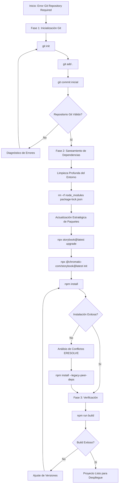
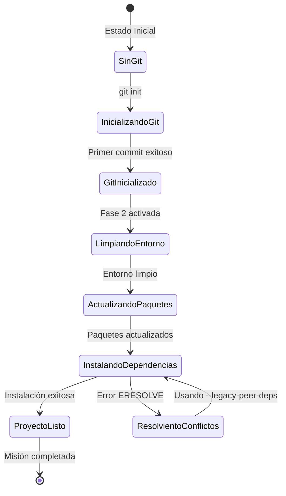
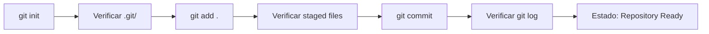
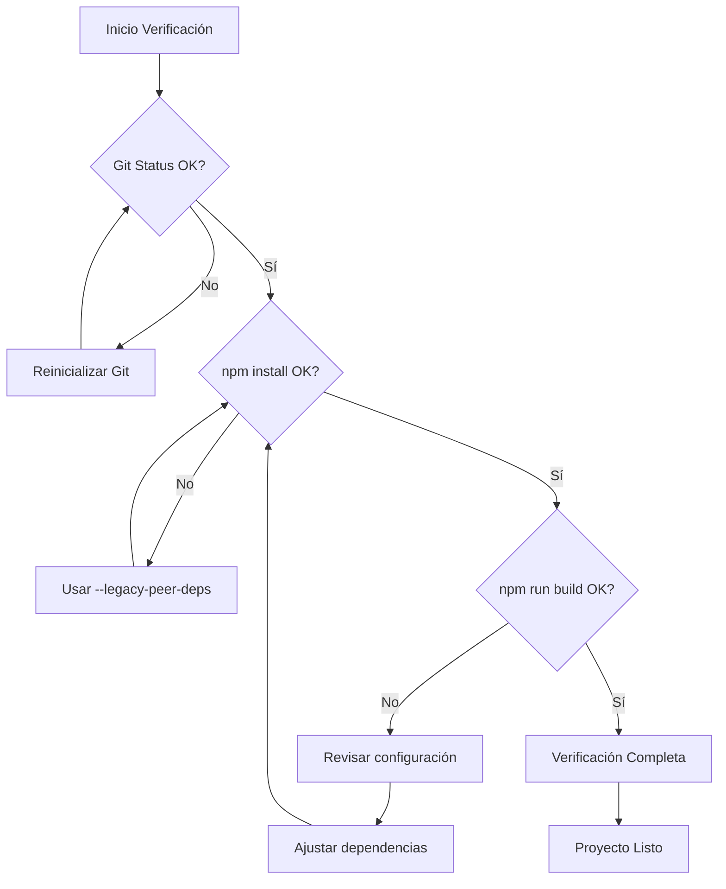
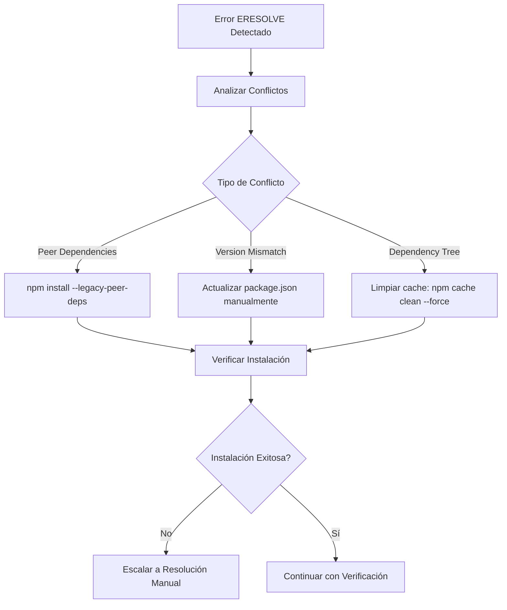

# Inicialización Git y Saneamiento de Dependencias

## Visión General
Esta tarea aborda un problema crítico de configuración del proyecto: la ausencia de un repositorio Git inicializado que impide la ejecución de herramientas de actualización como Storybook y Chromatic. El objetivo principal es establecer un repositorio Git funcional y proceder con el saneamiento completo de dependencias para resolver conflictos ERESOLVE y preparar el proyecto para despliegue en Vercel.

### Contexto del Problema
- **Error Principal**: "A git repository is required" - Las herramientas de actualización no pueden operar sin un repositorio Git
- **Impacto**: Bloqueo del proceso de actualización de dependencias y despliegue
- **Objetivo Final**: Proyecto Git funcional con dependencias saneadas y listo para producción

## Arquitectura del Proceso de Solución

### Diagrama de Flujo del Proceso


### Arquitectura de Estados del Sistema


## Fases de Implementación

### Fase 1: Corrección del Prerrequisito Faltante (Git)

#### Inicialización del Repositorio Git
| Comando | Propósito | Resultado Esperado |
|---------|-----------|-------------------|
| `git init` | Inicializar repositorio Git local | Directorio .git creado |
| `git add .` | Agregar todos los archivos al staging | Archivos preparados para commit |
| `git commit -m "Initial commit: Project setup before dependency sanitation"` | Crear commit inicial | Historial Git establecido |

#### Validación de Inicialización


### Fase 2: Ejecución del Plan de Saneamiento de Dependencias

#### Limpieza Profunda del Entorno
- **Acción**: Eliminación completa de `node_modules` y `package-lock.json`
- **Propósito**: Garantizar instalación limpia sin conflictos previos
- **Comando**: `rm -rf node_modules package-lock.json`

#### Actualización Estratégica de Paquetes
| Herramienta | Comando | Función |
|-------------|---------|---------|
| Storybook | `npx storybook@latest upgrade` | Actualizar componentes y configuración de Storybook |
| Chromatic | `npx @chromatic-com/storybook@latest init` | Inicializar Chromatic para pruebas visuales |

#### Instalación Final y Consolidación
- **Comando Principal**: `npm install`
- **Comando Alternativo** (si hay conflictos): `npm install --legacy-peer-deps`
- **Propósito**: Reconstruir árbol de dependencias con versiones actualizadas

### Fase 3: Criterios de Éxito y Verificación

#### Matriz de Verificación
| Criterio | Comando de Verificación | Estado Esperado |
|----------|------------------------|-----------------|
| Git Repository | `git status` | Repositorio inicializado con commit |
| Instalación Limpia | `npm install` | Sin errores ERESOLVE |
| Build Funcional | `npm run build` | Compilación exitosa |
| Dependencias Actualizadas | `npm outdated` | Mínimas o ninguna dependencia desactualizada |

#### Diagrama de Verificación


## Manejo de Conflictos y Recuperación

### Estrategias de Resolución de Conflictos ERESOLVE


### Tabla de Resolución de Problemas
| Problema | Síntoma | Solución |
|----------|---------|----------|
| Git no inicializado | "A git repository is required" | `git init && git add . && git commit -m "Initial commit"` |
| Error ERESOLVE | Conflictos de peer dependencies | `npm install --legacy-peer-deps` |
| Build fallido | Errores de compilación TypeScript | Verificar compatibilidad de versiones en package.json |
| Cache corrupto | Instalación inconsistente | `npm cache clean --force` |

## Configuración de Dependencias Objetivo

### Dependencias Críticas a Actualizar
| Paquete | Versión Actual | Versión Objetivo | Impacto |
|---------|----------------|------------------|---------|
| Storybook | N/A | Latest | Herramientas de desarrollo de componentes |
| Chromatic | N/A | Latest | Pruebas visuales automatizadas |
| Next.js | 15.4.7 | Mantener | Framework base estable |
| React | ^18 | Mantener | Compatibilidad establecida |

### Estructura de package.json Post-Actualización
```json
{
  "dependencies": {
    "next": "15.4.7",
    "react": "^18",
    "react-dom": "^18",
    "framer-motion": "^12.23.12",
    "gsap": "^3.13.0",
    "three": "^0.179.1"
  },
  "devDependencies": {
    "@storybook/...": "latest",
    "@chromatic-com/storybook": "latest",
    "@types/node": "^20",
    "@types/react": "^18",
    "@types/react-dom": "^18",
    "@types/three": "^0.179.0",
    "typescript": "^5"
  }
}
```

## Preparación para Despliegue en Vercel

### Requisitos Pre-Despliegue
1. **Repositorio Git activo** con historial de commits
2. **Dependencias instaladas** sin errores ERESOLVE
3. **Build exitoso** confirmado localmente
4. **Configuración de Vercel** validada

### Checklist de Preparación
- [ ] Git repository inicializado
- [ ] Commit inicial realizado
- [ ] Dependencias actualizadas (Storybook/Chromatic)
- [ ] `npm install` ejecutado exitosamente
- [ ] `npm run build` completado sin errores
- [ ] Configuración de Vercel revisada
- [ ] Variables de entorno configuradas (si necesario)

## Resultado Final Esperado

### Estado del Proyecto Post-Ejecución
1. **Repositorio Git funcional** con estructura de commits limpia
2. **Árbol de dependencias consistente** sin conflictos ERESOLVE
3. **Herramientas actualizadas** (Storybook y Chromatic) operativas
4. **Proyecto compilable** y listo para producción
5. **Preparado para conexión** a repositorio remoto (GitHub)
6. **Configurado para despliegue** automático en Vercel

### Métricas de Éxito
- **Tiempo de build**: < 3 minutos
- **Errores de dependencias**: 0
- **Warnings críticos**: 0
- **Compatibilidad de navegadores**: Mantenida
- **Performance score**: Sin degradación

## Consideraciones Técnicas

### Compatibilidad del Ecosistema
- **Node.js**: Versión 18.x o 20.x recomendada
- **npm**: Versión 8+ para mejor resolución de dependencias
- **TypeScript**: Versión 5.x mantenida para compatibilidad
- **Next.js**: 15.4.7 estable para producción

### Impacto en el Rendimiento
- **Bundle size**: Monitoreo post-actualización requerido
- **Tree-shaking**: Verificación de optimizaciones mantenidas
- **Lazy loading**: Confirmación de funcionalidad preservada
- **WebGL resources**: Cleanup apropiado confirmado